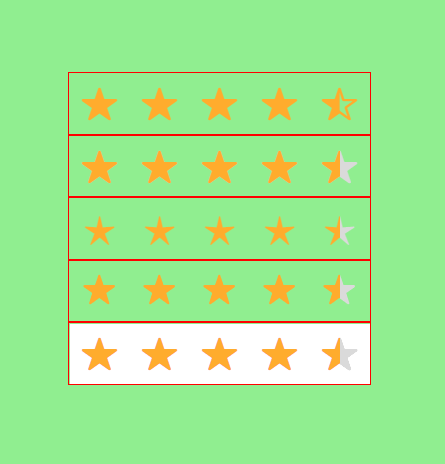

# 4.5 颗星

## 前言

今天我来讲述一则故事。

话不多说，今天的故事与一张图有关：


看到了没，闪闪的 4.5 颗星。

前些天某位大佬在演示这闪闪的 4.5 颗星实现的时候，我不经意地瞟了一眼代码。嘴角些许上扬：呵，居然用的是图片来实现的，水平看来不咋地！要是换做我，肯定 N 种方法！

然后我就开始认真的想了想这 N 种方法到底有哪几种。。。

---

_我首先想的是：图片多 low 啊，还不如 css 画的呢！_

## 用 CSS 画出来

在一顿胡思乱想之后，最终决定用一个 CSS icon 库[ionicons](https://ionicons.com/)。

立马写下了如下代码：

```html
<div class="containers">
  <div class="css-only">
    <div class="star"><i class="icon ion-ios-star"></i></div>
    <div class="star"><i class="icon ion-ios-star"></i></div>
    <div class="star"><i class="icon ion-ios-star"></i></div>
    <div class="star"><i class="icon ion-ios-star"></i></div>
    <div class="star"><i class="icon ion-ios-star-half"></i></div>
  </div>
</div>
```

```css
.css-only {
  display: flex;
  color: rgb(255, 172, 45);
}
.css-only .star {
  width: 2rem;
  height: 2rem;
  padding: 0.5rem;
  display: flex;
  flex-direction: column;
  justify-content: center;
  align-items: center;
}
```


这里的每颗星都是由 CSS 画出来的，最后那半颗也是，类名不同罢了。

等我写完这段代码之后，我突然的赶紧似乎和我们想要实现的效果有那么一点不一样：最后那半颗星的颜色不同。

## 第一次升级

```html
<div class="containers">
  <div class="double-1">
    <div class="star"><i class="icon ion-ios-star"></i></div>
    <div class="star"><i class="icon ion-ios-star"></i></div>
    <div class="star"><i class="icon ion-ios-star"></i></div>
    <div class="star"><i class="icon ion-ios-star"></i></div>
    <div class="star"><i class="icon ion-ios-star"></i></div>
  </div>
  <div class="double-2">
    <div class="star"><i class="icon ion-ios-star"></i></div>
    <div class="star"><i class="icon ion-ios-star"></i></div>
    <div class="star"><i class="icon ion-ios-star"></i></div>
    <div class="star"><i class="icon ion-ios-star"></i></div>
    <div class="star"><i class="icon ion-ios-star"></i></div>
  </div>
</div>
```

```css
.double-1,
.double-2 {
  display: flex;
}
.double-1 .star,
.double-2 .star {
  width: 2rem;
  height: 2rem;
  padding: 0.5rem;
  display: flex;
  flex-direction: column;
  justify-content: center;
  align-items: center;
  flex-shrink: 0;
}
.double-1 {
  color: rgb(218, 218, 218);
}
.double-2 {
  position: absolute;
  top: 0;
  left: 0;
  width: 13.5rem;
  overflow: hidden;
  color: rgb(255, 172, 45);
}
```


在写完代码之后看了看，嗯，感觉很满意。但是越看越觉得这和放几张图片没啥两样。

## 使用-webkit-background-clip

> 先简单的介绍一下，-webkit-background-clip 是用来设置背景的范围的，如果读者有疑惑可以参考我的上一篇文章：[CSS3 的一对孪生兄弟之 background & mask](https://juejin.im/post/5ca75769e51d452be1237dfd)

既然想要装逼，那必须用一些一般人不会用的属性，这样才能显得很有能耐！

```html
<div class="containers">
  <p class="bgClip">
    <span class="star">★</span><span class="star">★</span
    ><span class="star">★</span><span class="star">★</span
    ><span class="star">★</span>
  </p>
</div>
```

```css
.bgClip {
  display: flex;
  background-image: -webkit-gradient(
    linear,
    0 50%,
    100% 50%,
    from(rgb(255, 172, 45)),
    color-stop(0.9, rgb(255, 172, 45)),
    color-stop(0.9, rgb(218, 218, 218)),
    to(rgb(218, 218, 218))
  );
  -webkit-background-clip: text;
  color: transparent;
}
.bgClip span {
  text-align: center;
  width: 2rem;
  height: 2rem;
  padding: 0.5rem;
}
```


通过设定 -webkit-background-clip: text;让背景只存在于文本之上。且将文本颜色设置为透明，这时候背景的颜色就会呈现出来。背景我们用一个颜色渐变去实现。

这种方法有一个小小的缺陷，非常依赖文本表情符号，一旦不是星星或者要求换成别的符号，有可能就实现不了。

## background 的孪生兄弟 mask

> mask 可以给容器添加遮盖，如果读者有疑惑可以参考我的上一篇文章：[CSS3 的一对孪生兄弟之 background & mask](https://juejin.im/post/5ca75769e51d452be1237dfd)

```html
<div class="containers">
  <div class="mask"></div>
</div>
```

```css
.mask {
  display: flex;
  width: 15rem;
  height: 3rem;
  background-image: -webkit-gradient(
    linear,
    0 50%,
    100% 50%,
    from(rgb(255, 172, 45)),
    color-stop(0.9, rgb(255, 172, 45)),
    color-stop(0.9, rgb(218, 218, 218)),
    to(rgb(218, 218, 218))
  );
  -webkit-mask-image: url(../svg/五角星.svg);
  -webkit-mask-size: 3rem;
  -webkit-mask-repeat: repeat-x;
}
```


我先给容器设置呢宽高和背景渐变色，然后通过设置遮罩图形为五角星，且沿 X 轴平铺，让背景色从遮罩图形中透出来，最终实现了效果！

但是这也有一个不好的地方，那就是遮罩图形很依赖于美工小姐姐的设计，我们没法控制两个小星星之间的距离，因为平铺是没有间隙的。如果美工小姐姐给我们的五角星的留白很少，我们的小星星就会连在一起，会很丑！

## mix-blend-mode

> mix 和 blend 的中文意译均为混合，那么这个属性的作用直译过来就是混合混合模式。mix-blend-mode 描述了元素的内容应该与元素的直系父元素的内容和元素的背景如何混合。

```html
<div class="containers">
  <div class="mbmContent">
    <div class="star"><i class="icon ion-ios-star"></i></div>
    <div class="star"><i class="icon ion-ios-star"></i></div>
    <div class="star"><i class="icon ion-ios-star"></i></div>
    <div class="star"><i class="icon ion-ios-star"></i></div>
    <div class="star"><i class="icon ion-ios-star"></i></div>
  </div>
  <div class="mbmScore"></div>
</div>
```

```css
.mbmContent {
  width: 15rem;
  height: 3rem;
  display: flex;
  color: rgb(0, 0, 0);
  background-color: #fff;
}
.mbmScore {
  position: absolute;
  top: 0;
  left: 0;
  width: 15rem;
  height: 3rem;
  background-image: -webkit-gradient(
    linear,
    0 50%,
    100% 50%,
    from(rgb(255, 172, 45)),
    color-stop(0.9, rgb(255, 172, 45)),
    color-stop(0.9, rgb(218, 218, 218)),
    to(rgb(218, 218, 218))
  );
  mix-blend-mode: lighten;
}
.mbmContent .star {
  width: 2rem;
  height: 2rem;
  padding: 0.5rem;
  display: flex;
  flex-direction: column;
  justify-content: center;
  align-items: center;
}
```


在这里，我将星星的颜色设置为了黑色，其父容器.mbmContent 的背景颜色为白色。我同时让.score 容器的脱离文档流且与.mbmContent 重合，设置渐变颜色。通过设置 mix-blend-mode: lighten，可以让.containers 这一父容器中的背景颜色以 lighten 方式混合，具体如何混合，这里不再熬述，读者若有兴趣，可以自行查阅资料。

## 后记

在写完这五种方法之后，总要评一评哪个是最好的方法。首先排除第一种，第三种和第四种。因为以上这几种我们在实现的时候都说明了各自的缺点。

对于第五种其实也是有缺点的：

当我们在外层容器设置一个背景颜色的时候，第五种缺点就暴露了。

```html
<div class="wrapper">
  <!-- 在最外层包裹一个容器 -->
</div>
```

```css
.wrapper {
  width: 100%;
  height: 100%;
  display: flex;
  flex-direction: column;
  flex-wrap: nowrap;
  justify-content: center;
  align-items: center;
  font-size: 2rem;
  background-color: lightgreen;
}
.containers {
  width: 15rem;
  height: 3rem;
  border: 1px solid red;
  position: relative;
}
```



由于第五种方法需要设置五角星容器的背景色为白色，所以当最外层设置了背景色的时候，会显得特别突兀，不协调。

**由此可以得出，最棒的方法是第二种！**

但是，写到这里不得不说直接用图片代替样式，可以让功能的实现变得更简单。但是倘若我想让星星颜色的填充可以动画的形式显示，或者每 0.1 分之差都体现出来的话，我觉得这时候第二种 方法应该是最棒的选择。

---

笔者专门在 github 上创建了一个仓库，用于记录平时学习全栈开发中的技巧、难点、易错点，欢迎大家点击下方链接浏览。如果觉得还不错，就请给个小星星吧！👍

---

2019/04/06

[AJie](https://github.com/KevinSalvatore/FullStackPoints.git)
