# CSS3 的一对孪生兄弟之 background & mask

**前言**

很多人在做前端开发的时候基本都用过 background 属性，但是 mask 属性却很少使用，甚至有些许陌生。但是实际上 mask 与 background 一样简单方便，甚至在某些地方比 background 更有优势！今天我们就来深度学习一下 background & mask！

---

## 再谈盒模型

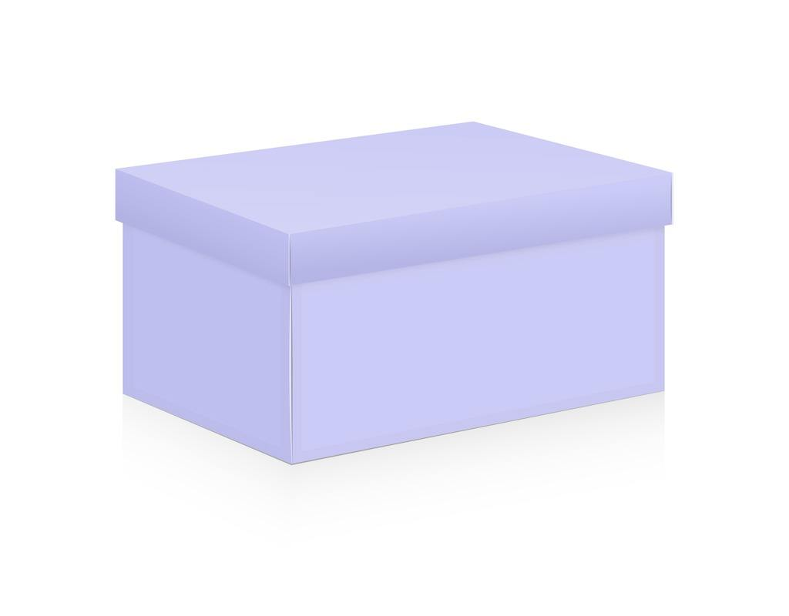

_可能有人会问为啥这里又提起盒模型的概念？实际上很多老师在讲述盒模型的时候，重心都放在了 margin、padding 和 border 上。而我们今天再谈的盒模型与这些无关。_

既然叫盒模型，任何盒子都应该有一个地面和一个盖子，就如上图所示一样。我们 div 中的内容放在盒子里面，自然也就在盒子底面的上面，而这里的底面就是我们今天要说的 background，背景。说到这里我想大家也应该意识到，这里的盖子就是我们要说的 mask，遮罩。

## 常用的几个基本属性

> 图像是由 rgb 三个通道以及第四个通道——alpha 通道，来绘制的。
>
> mask 的功能就是使用透明的图片或渐变遮罩元素的背景。于是，mask 与背景 background 非常类似。这就是为什么说 background 和 mask 是一对孪生兄弟！

**值得一提：mask-mode 仅 Firefox 浏览器支持，Chrome 浏览器是基于 alpha 遮罩。`遮罩元素的alpha值为0的时候会完全覆盖下面的元素，为1的时候会完全显示下面的内容。`这里我们以 Chrome 浏览器作为我们的开发环境，所以 mask 在这里仅使用 alpha 遮罩。在这里我也不会讨论 mask-mode 属性，如有需求请自行查阅资料！**

### 共性

**先举个栗子：**

现在有结构如下：

```html
<div class="wrapper">
  <div class="container">
    我爱你！我爱你！我爱你！我爱你！我爱你！我爱你！我爱你！我爱你！我爱你！
  </div>
</div>
```

样式如下：

```css
.container {
  width: 250px;
  height: 250px;
  font-size: 2rem;
  overflow: hidden;
}
```

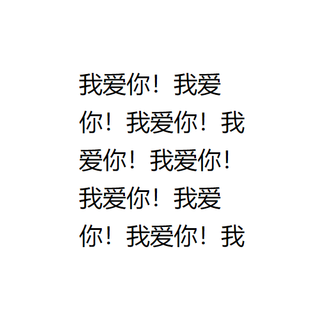

#### background-image & mask-image

- none（默认值）

  啥都没有

- gradient

  添加渐变色！


我们给之前的结构加个渐变背景色：

```css
background-image: -webkit-gradient(
  linear,
  left top,
  right bottom,
  from(rgb(255, 192, 159)),
  to(rgb(255, 238, 147))
);
```

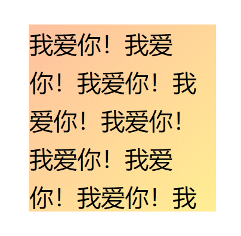

我们再加一个遮罩 maks，这里我们用了一张 png 图片，如下：

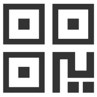

```css
-webkit-mask-image: url(../images/example.png);
```

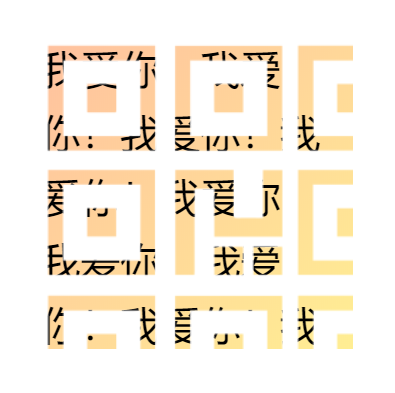

**这里我们不用渐变色是有原因的，因为 Chrome 浏览器所支持的 mask-mood 只基于 alpha 通道，所以渐变本身的颜色并不会作用于样式上，只有 rgba 中的第四通道值是有效的。而且显示出来的只有不同透明程度的白色样式，具体如下：**

```css
-webkit-mask-image: -webkit-gradient(
  linear,
  left bottom,
  right top,
  from(rgba(221, 80, 67, 1)),
  to(rgba(0, 0, 0, 0))
);
```

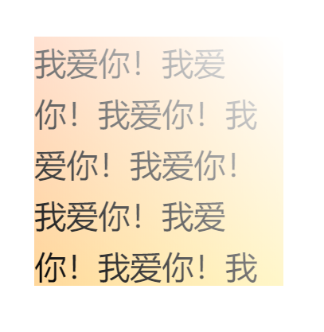

_遮罩元素的 alpha 值为 0 的时候会完全覆盖下面的元素，为 1 的时候会完全显示下面的内容。这也是为啥我们选择 png 图片的原因。_

#### background-size & mask-size

设置背景或者遮罩图片的大小。

这里我们先将背景换为一张图片：

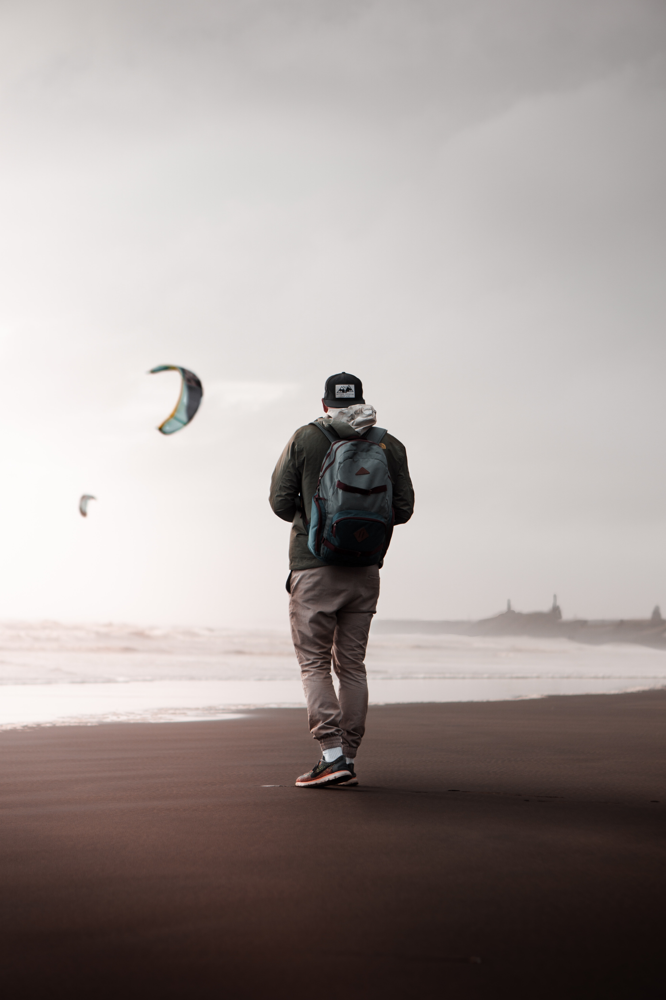

_分辨率 3937&times;5906_

```css
.container {
  width: 250px;
  height: 250px;
  font-size: 2rem;
  overflow: hidden;
  background-image: url(../images/man.jpg);
}
```

这时候的样式如下：

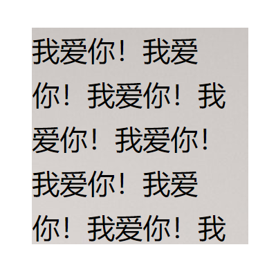

背景图片之所以只显示了左上角的一小部分是因为背景图片的分辨率太大了，而我们的盒子只是 250px&times;250px 的大小，默认背景图片的左上角与盒子的左上角是一致的，所以只显示了左上角一小部分。

这里我们就可以运用 background-size 属性来进行调整了：

```css
background-size: length|percentage（以父元素的百分比来设置背景图像的宽度和高度）|cover|contain;
```

这里着重讨论 cover|contain 这两个值：
| 属性值 | 描述 |
| ------- | ------------------------------------------------------------ |
| cover | 把背景图像扩展至足够大，以使背景图像完全覆盖背景区域。背景图像的某些部分也许无法显示在背景定位区域中。 |
| contain | 把图像图像扩展至最大尺寸，以使其宽度和高度完全适应内容区域。 |

我们这里为了让背景图片完全显示，所以旋转 contain。

```css
background-size: contain;
```

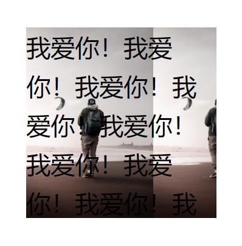

我们也为 mask 添加 mask-size，这里我们使用 cover。

```css
-webkit-mask-size: cover;
```

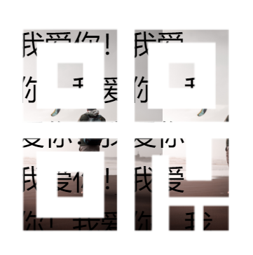

_由于我们 mask 的图片长宽比与盒子长宽比一样，所以我们只能看到一个遮罩图片。_

#### background-repeat & mask-repeat

这个字面意思就是：背景图片或者遮罩是否重复出现。

对于这一属性只有两个值：repeat（重复（默认值））/no-repeat（不重复（仅显示一次））

这里我们添加如下两个属性：

```css
background-repeat: no-repeat;
-webkit-mask-repeat: no-repeat;
```

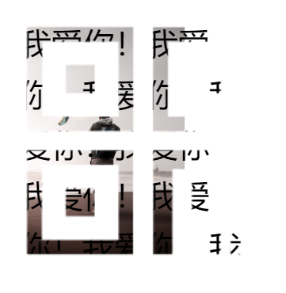

_可以看到背景只显示了一次而并未重复出现。由于我们的遮罩本身就只能看到一次，所以在这里设置 no-repeat 并没有什么实际效果。_

#### background-position & mask-position

设置背景图片或者遮罩图片的位置。

| 值                                            | 描述                                                                                                                                                                        |
| --------------------------------------------- | --------------------------------------------------------------------------------------------------------------------------------------------------------------------------- |
| x y<br />x,y=top\|left\|right\|bottom\|center | 如果您仅规定了一个关键词，那么第二个值将是"center"。默认值：0% 0%。<br />可以接偏移量，如：background-position: right 40px bottom 20px;                                     |
| x% y%                                         | 第一个值是水平位置，第二个值是垂直位置。左上角是 0% 0%。右下角是 100% 100%。如果您仅规定了一个值，另一个值将是 50%。                                                        |
| xpos ypos                                     | 第一个值是水平位置，第二个值是垂直位置。左上角是 0 0。单位是像素 (0px 0px) 或任何其他的 CSS 单位。如果您仅规定了一个值，另一个值将是 50%。您可以混合使用 % 和 position 值。 |

**这里有一点需要注意：**

`<position>`值对应的容器坐标位置实际上有一个公式的：

```
positionX = (容器的宽度-图片的宽度) * percentX;
positionY = (容器的高度-图片的高度) * percentY;
```

当`background-position:100% 100%`时候，实际定位值就是容器尺寸和图片尺寸的差异，于是就有了右下角定位效果。

`了解更多`[CSS <position>值简介理解 background 百分比定位](https://www.zhangxinxu.com/wordpress/2015/03/background-object-position-value-percent/)

这里我们让背景图片居中，且改变 mask 的大小为容器宽度的一半，让其也居中显示。

```css
background-position: center;
-webkit-mask-size: 50%;
-webkit-mask-position: center;
```

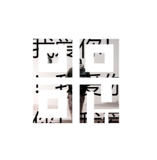

可以看到背景和缩小后的遮罩都已经居中显示了。

#### background-origin & mask-origin

规定 background-position 和 mask-position 属性相对于什么位置来定位。

```css
background-origin: padding-box（默认值）|border-box|content-box;
-webkit-mask-origin: padding-box|border-box（默认值）|content-box|margin-box;
```

| 值          | 描述                           |
| ----------- | ------------------------------ |
| padding-box | 背景图像相对于内边距框来定位。 |
| border-box  | 背景图像相对于边框盒来定位。   |
| content-box | 背景图像相对于内容框来定位。   |
| margin-box  | 背景图像相对于边距框来定位。   |

我们重新写一下盒子样式：

```css
.container {
  width: 250px;
  height: 250px;
  font-size: 2rem;
  overflow: hidden;
  border: 10px solid rgba(255, 0, 0, 0.5);
  background-image: url(../images/man.jpg);
  background-repeat: no-repeat;
  background-size: 100px;
}
```

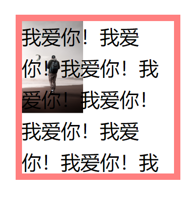

关于上述样式就不再说明了，这时候我添加如下样式：

```css
background-origin: border-box;
```

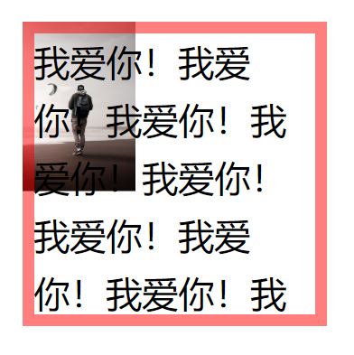

可以看到背景图片起点由 padding-box 的左上角变为了 border-box 的左上角。

现在加上 mask：

```css
-webkit-mask-image: url(../images/example.png);
-webkit-mask-size: 50px;
```

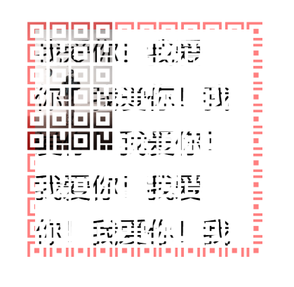

可以看出 mask 的默认值是 border-box。

我们将其改为 padding-box：

```css
-webkit-mask-origin: padding-box;
```

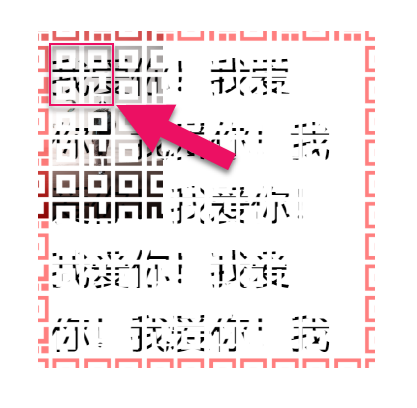

可以看到遮罩是由 padding-box 的左上角为原点开始平铺的。

#### background-clip & mask-clip

设置元素的背景或遮罩背景的绘制区域。

```css
background-clip: border-box（默认值）|padding-box|content-box|text;
-webkit-mask-clip: border-box（默认值）|padding-box|content-box|margin-box;
```

同样我们重写一下样式：

```css
.container {
  width: 250px;
  height: 250px;
  font-size: 2rem;
  overflow: hidden;
  border: 10px solid rgba(255, 0, 0, 0.3);
  background-image: url(../images/man.jpg);
  background-size: 100px;
  background-origin: border-box;
  background-position: 0 0;
}
```

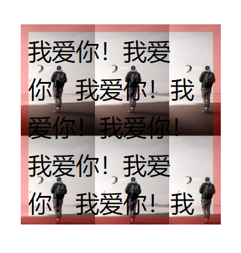

可以看到，在默认情况下，背景图片在 border 范围之内都进行了平铺。

当我们设置：

```css
background-clip: padding-box;
```

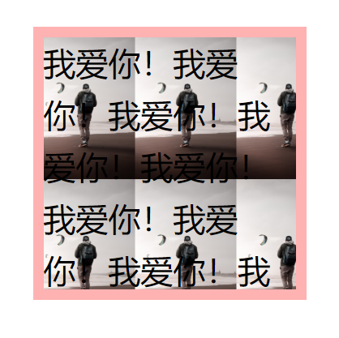

可以看到平铺范围被限定在了 padding 范围之内了。

**值得一提：background-clip：text**

```html
<div class="container">Love You!</div>
```

```css
.container {
  font-size: 5rem;
  font-weight: bolder;
  color: transparent;
  background-image: url(../images/scene.jpg);
  background-size: cover;
  background-position: center;
  -webkit-background-clip: text;
}
```

这里用的背景：


Love You! + scene.jpg = 如下：

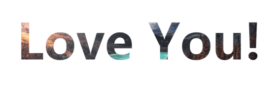

#### background-attachment & mask-attachment

设置背景图像或者遮罩图像的位置是固定在 viewport 内，还是与其容器一起滚动。

```css
background-attachment: scroll（默认值）|fixed|local;
mask-attachment: scroll（默认值）|fixed|local;
```

| 值     | 描述                                                                                                                                                          |
| ------ | ------------------------------------------------------------------------------------------------------------------------------------------------------------- |
| scroll | 相对于元素本身固定， 而不是随着它的内容滚动。                                                                                                                 |
| local  | 相对于元素的内容固定。如果一个元素拥有滚动机制，背景/遮罩将会随着元素的内容滚动， 并且背景/遮罩的绘制区域和定位区域是相对于可滚动的区域而不是包含他们的边框。 |
| fixed  | 相对于视口固定。即使一个元素拥有滚动机制，背景/遮罩也不会随着元素的内容滚动。                                                                                 |

**这里我们着重介绍 background-attachment。**

background-attachment 是 CSS3 视差特效最棒的实现方法。这里推荐一下一位作者的文章写得非常棒！[滚动视差？CSS 不在话下](https://juejin.im/post/5b6d0756e51d4562b31ad23c)

这里我们也来实现一个炫技：

想看成品：

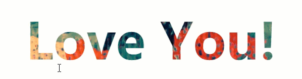

```html
<div class="wrapper">
  <div class="container">
    <div class="div text">Love You!</div>
    <div class="div"></div>
    <div class="div text">Love Me!</div>
    <div class="div"></div>
    <div class="div text">Love life!</div>
  </div>
</div>
```

```css
::-webkit-scrollbar {
  display: none;
}
.container {
  width: 30rem;
  height: 8rem;
  overflow: scroll;
  border: 1px solid red;
}
.container > div {
  width: 30rem;
  height: 8rem;
  background-color: #ffffff;
  font-size: 5rem;
  font-weight: bolder;
  color: transparent;
  text-align: center;
  background-size: cover;
  background-position: center;
  background-attachment: fixed;
}
.container :nth-child(1) {
  -webkit-background-clip: text;
  background-image: url(../images/scene-1.jpg);
}
.container :nth-child(2) {
  background-image: url(../images/scene-0.jpg);
}
.container :nth-child(3) {
  -webkit-background-clip: text;
  background-image: url(../images/scene-2.jpg);
}
.container :nth-child(4) {
  background-image: url(../images/scene-4.jpg);
}
.container :nth-child(5) {
  -webkit-background-clip: text;
  background-image: url(../images/scene-3.jpg);
}
```

**这里我们通过设置 background-attachment: fixed;让背景图片相对于窗口固定，而不会让背景图片随内容的滚动而滚动。**

### 特性

#### background

##### background-color

给背景设置颜色。它的层级比背景图片还靠后，是盒模型的最底部！

**开发人员应当在给元素设定背景图的同时给元素指定背景色，当背景图不可用时背景色替代。**

#### mask

##### mask-composite（不做详细介绍）

表示当同时使用多个图片进行遮罩时候的混合方式。

这里只简单的介绍其中几个值：

| 值          | 描述                                       |
| ----------- | ------------------------------------------ |
| source-over | 遮罩累加。                                 |
| source-in   | 重叠的位置是遮罩，不重叠的位置表现为透明。 |
| source-out  | 重叠的位置是不遮罩，表现为透明。           |

---

笔者专门在 github 上创建了一个仓库，用于记录平时学习全栈开发中的技巧、难点、易错点，欢迎大家点击下方链接浏览。如果觉得还不错，就请给个小星星吧！👍

---

2019/04/05

[AJie](https://github.com/KevinSalvatore/FullStackPoints.git)
