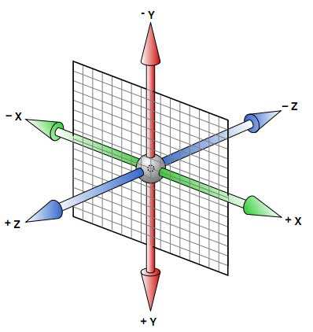
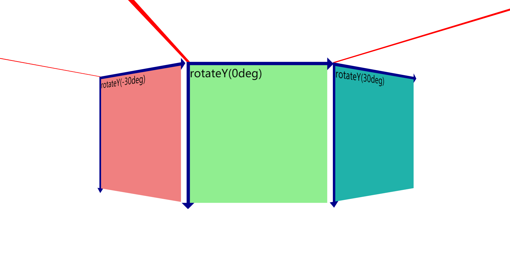
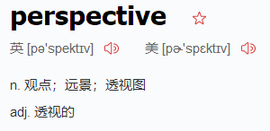
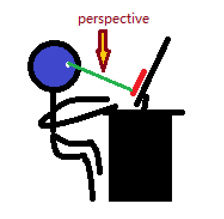
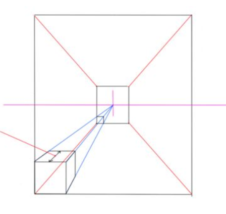
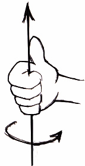
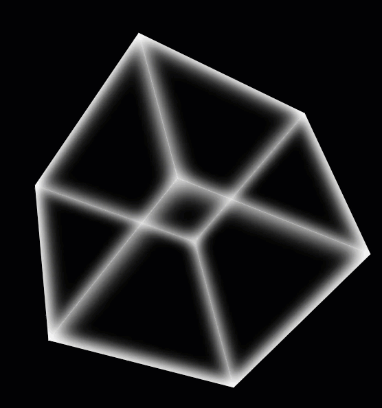

# CSS3 之 3D 变换

[TOC]

---

> 我们大多数同学接触的 CSS3: transform 属性值一般都是 2D 变换，比如 ：
>
> - 平移操作：translateX()，translateY()，亦或是 translate(x,y)。
> - 旋转操作：rotate()
>
> 今天我们就来学习并且深入理解 CSS3 中的 3D 变换！

## CSS3 中 3D 的一些基本概念

**在讨论 3D 之前我们先要对一些基本概念做一些理解。**

### 3D 坐标系

话不多说先上图：



我们都知道，在浏览器中，是以左上角的顶点作为原点，向右、向下为正方向的的视窗。其中横向为 X 轴，纵向为 Y 轴。而对于三维空间中的 Z 轴，自然是指垂直与该 X 轴与 Y 轴所构建的平面且穿过原点的直线。对于二维视图而言由于 X 轴与 Y 轴始终确定，所以 Z 轴也是确定的：即穿过窗口左上角且与屏幕垂直的直线。屏幕的前方为正方向。

> 但是这里容易产生一个**误解**：_误以为三维空间中的 Z 轴也是固定的，和二维视图的 Z 轴是同一根轴线。_

Z 轴真正的含义是垂直与 X 轴与 Y 轴所构成的面且穿过原点的直线。那么当这个面发送旋转或平移的时候，Z 轴也是随之而变的！这里我用一张图片进行说明：



这里的每根红轴为 Z 轴，分别垂直于各自的面！

### perspective 属性

perspective 的字面意思如下：



近大远小在二维平面上是无法体现的，但是在三维空间中离我们眼球越近的事物是越来越大的。

而 perspective 这个属性定义的其实是我们离画面假定的初始像素距离。



_这张图费尽了毕生的绘画天赋。。。_

加入我们定义了这么一个属性：

```css
perspective: 800px;
```

那么我们就假定我们的眼球这一视点到该属性所在的元素之间的距离是 800px。（有一个前提：该元素 X 轴与 Y 轴所构成的平面与窗口平面平行。）实际上在这里人眼到 X 轴与 Y 轴所构成的平面的距离就是 800px（Z 轴方向）。

如果平面发生了旋转，**视点也是会跟着旋转的**！

那么有同学就会问了：这个属性到底有啥用？先别急嘛！

如果这个元素之后通过三维变换离我们的距离变近了，那么他们呈现在我们眼前的大小将变大，反之变小。（近大远小）这一特性并不是表面看的那么简单，就拿之前我们假设定义的那个属性和那张我画的图说：意思也就是我的眼球和我看到的元素之间有 800px 的长度，这时候我让该元素沿着 Z 轴的正方项平移 801px 的距离。平移之后你会发现你看不到这个元素了，究其原因是因为这个图片在三维空间中，已经跑到你眼球的后面了！所以你当然看不到了。

### transform-style: preserve-3d;

这一属性值的设定就像是一个 3D 控件的声明，告诉浏览器的渲染引擎接下来的子元素需要按照 3D 模式进行渲染！（默认 2D 模式）所以该属性应该**设置在父容器之中**！

注意该元素**不具有继承性**！！但是该元素**不具有继承性**！！但是该元素**不具有继承性**！！（重要的事情说三遍。。。）

### perspective-origin 属性

> 引用 W3C 的话：perspective-origin 属性定义 3D 元素所基于的 X 轴和 Y 轴。该属性允许您改变 3D 元素的底部位置。
>
> 当为元素定义 perspective-origin 属性时，其子元素会获得透视效果，而不是元素本身。
>
> **注释**：该属性必须与 perspective 属性一同使用，而且只影响 3D 转换元素

用白话翻译一下，其实也就是：透视点的位置。



透视点的默认值为 50% 50%，也不具备继承性。该属性必须与 perspective 属性一同使用，而且只影响 3D 转换元素。

### translateZ(), rotateX(), rotateY(), rotateZ()

有了前面的知识作为铺垫，平移、旋转理解起来也就容易了。

- translateZ()：沿着 Z 轴平移
- rotateX()：沿着 X 轴旋转
- rotateY()：沿着 Y 轴旋转
- rotateZ()：沿着 Z 轴旋转

**旋转的正方向：**网页窗口都是左手坐标系，所以应当用左手判断旋转的正方向。

**具体判断方法：**左手握住拳头，拇指只想旋转轴的正方向，四指弯曲的方向就是旋转的正方向。



## CSS3 中 3D 的一些案例

### 魔方

**效果图：**



**要实现一个正方体可以通过六个面旋转后沿着各自的 Z 轴进行平移获得**

```html
<div class="cube">
  <div class="cover cover_front"></div>
  <div class="cover cover_back"></div>
  <div class="cover cover_left"></div>
  <div class="cover cover_right"></div>
  <div class="cover cover_top"></div>
  <div class="cover cover_bottom"></div>
</div>
```

```css
.cube {
  position: absolute;
  top: 50%;
  left: 50%;
  transform: translate(-50%, -50%) rotate(0deg);
  width: 250px;
  height: 250px;
  transform-style: preserve-3d;
  perspective: 1000px;
  animation: rotate 5s linear infinite;
}
@keyframes rotate {
  0% {
    transform: translate(-50%, -50%) rotate(0deg);
  }
  100% {
    transform: translate(-50%, -50%) rotate(360deg);
  }
}
.cover {
  position: absolute;
  width: 250px;
  height: 250px;
  box-shadow: 0 0 25px 5px #ffffff inset;
}
.cover_front {
  transform: rotateX(45deg) rotateY(45deg) translateZ(125px);
}
.cover_back {
  transform: rotateX(45deg) rotateY(45deg) translateZ(-125px);
}
.cover_left {
  transform: rotateX(45deg) rotateY(135deg) translateZ(125px);
}
.cover_right {
  transform: rotateX(45deg) rotateY(-45deg) translateZ(125px);
}
.cover_top {
  transform: rotateX(135deg) rotateZ(45deg) translateZ(125px);
}
.cover_bottom {
  transform: rotateX(-45deg) rotateZ(-45deg) translateZ(125px);
}
```

### 炫彩发光球

**效果图：**


通过给每个色斑不同的旋转角度，并且加以动画的形式体现。

```html
<div class="ball">
  .spot*100
</div>
```

**由于 html 页面中设定了 100 个类名为 spot 的 div，而且每个 sopt 初始的样式都是不同的，且运动轨迹也不一样，所以这里用 css 预编译语言 stylus 来进行实现。**

```stylus
vendors = official

random(min,max)
  return floor(math(0, 'random')*(max - min + 1) + min)

*
  margin 0
  padding 0

html
body
  width 100vw
  height 100vh
  background-color #000000

.ball
  width 10px
  height 10px
  top 50%
  left 50%
  transform: translate(-50%, -50%)
  position relative
  transform-style: preserve-3d
  perspective: 1000px

.spot
  width 10px
  height 10px
  position absolute
  border-radius: 50%

animation(n)
  animation twinkle+n 20s linear infinite

getdifference()
  transform: rotateX(unit(random(0,360),'deg')) rotateY(unit(random(0,360),'deg')) translateZ(50px)
  background-color rgba(random(0,255),random(0,255),random(0,255),random(0,1))

for num in 1..100
  .spot:nth-child({num})
    $xDeg = random(0,360)
    $yDeg = random(0,360)
    $red = random(0,255)
    $green = random(0,255)
    $blue = random(0,255)
    $alpha = random(0,1)
    transform: rotateX(unit($xDeg,'deg')) rotateY(unit($yDeg,'deg')) translateZ(50px)
    background-color rgba($red,$green,$blue,$alpha)
    animation num
    @keyframes twinkle{num}
      20%
        getdifference()
      40%
        getdifference()
      60%
        getdifference()
      80%
        getdifference()
      100%
        transform: rotateX(unit($xDeg,'deg')) rotateY(unit($yDeg,'deg')) translateZ(50px)
        background-color rgba($red,$green,$blue,$alpha)
```

---

笔者专门在 github 上创建了一个仓库，用于记录平时学习全栈开发中的技巧、难点、易错点，欢迎大家点击下方链接浏览。如果觉得还不错，就请给个小星星吧！👍

---

2019/03/30

[AJie](https://github.com/KevinSalvatore/FullStackPoints.git)
