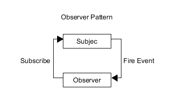
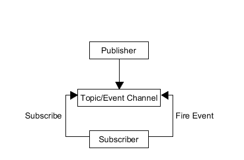

# JavaScript 设计模式之观察者模式与发布订阅模式

## 前言

> 在软体工程中，设计模式（design pattern）是对软体设计中普遍存在（反复出现）的各种问题，所提出的解决方案。
>
> 设计模式并不直接用来完成程式码的编写，而是描述在各种不同情况下，要怎么解决问题的一种方案。
>
> 设计模式能使不稳定转为相对稳定、具体转为相对抽象，避免会引起麻烦的紧耦合，以增强软体设计面对并适应变化的能力
>
> ——[维基百科](<https://zh.wikipedia.org/wiki/%E8%AE%BE%E8%AE%A1%E6%A8%A1%E5%BC%8F_(%E8%AE%A1%E7%AE%97%E6%9C%BA)>)

设计模式是一种软件开发的思想，有益于降低代码的耦合性，增强代码的健壮性。往往在大型项目中用的比较多。

今天就来介绍一下观察者模式与发布订阅模式。这在解耦中非常实用。

## 什么是观察者模式？

**先举一个简单的例子**：

毕业前，很多同学都会说类似于这样的话：

“老王，等你结婚了，记得叫我来喝喜酒！”

于是有一天你真的要结婚了，且需要举办酒席，这时候你需要通知你的你的那些老友来喝喜酒。于是你拿起了手机给你的那些分布于世界各地的好朋友打起了电话，说了结婚酒席一事。

到了酒席那天，有的朋友来了，有的人没来礼却到了，有的呢只有简短的两句祝福，剩下的只有推脱。

**这就是观察者模式**



在观察者模式中，目标与观察者相互独立，又相互联系：

- 两者都是相互独立的对对象个体。
- 观察者在目标对象中订阅事件，目标广播发布事件。

就像之前的例子一样：

- 老王就是模式中所谓的目标。
- 同学们在毕业前说的话就相当于在目标对象上订阅事件。
- 老王打电话通知朋友就是发布事件。
- 同学们各自作出了不同的行动回应。

这么说我们的代码就慢慢建立起来了。

首先我们需要定义两个对象：

1. 目标对象：Subject
2. 观察者对象：Observer

并且在目标对象中要存放观察者对象的引用，就像老王要存放同学的手机好一样，只有存了才能联系嘛。于是我们有了下面的代码：

```javascript
function Subject() {
  this.observers = new ObserverList();
}
function ObserverList() {
  this.observerList = [];
}
function Observer() {}
```

对于目标对象中的引用，我们必须可以动态的控制：

```javascript
ObserverList.prototype.add = function(obj) {
  return this.observerList.push(obj);
};

ObserverList.prototype.count = function() {
  return this.observerList.length;
};

ObserverList.prototype.get = function(index) {
  if (index > -1 && index < this.observerList.length) {
    return this.observerList[index];
  }
};

ObserverList.prototype.indexOf = function(obj, startIndex) {
  var i = startIndex;

  while (i < this.observerList.length) {
    if (this.observerList[i] === obj) {
      return i;
    }
    i++;
  }
  return -1;
};

ObserverList.prototype.removeAt = function(index) {
  this.observerList.splice(index, 1);
};

Subject.prototype.addObserver = function(observer) {
  this.observers.add(observer);
};

Subject.prototype.removeObserver = function(observer) {
  this.observers.removeAt(this.observers.indexOf(observer, 0));
};
```

这样我们就能对老王手机联系人进行增、删、查的操作了。

现在我们就要考虑发布消息的功能函数了。首先必须明确一点：目标对象并不能指定观察者对象做出什么相应的变化。目标对象只有通知的作用。就像老王只能告诉朋友他要办喜酒了，至于朋友接下来怎么办，则全是朋友自己决定的。

所以我们得写一个目标广播消息的功能函数：

```javascript
Subject.prototype.notify = function(context) {
  var observerCount = this.observers.count();
  for (var i = 0; i < observerCount; i++) {
    this.observers.get(i).update(context);
  }
};
```

我们将具体的观察者对象该作出的变化交给了观察者对象自己去处理。这就要求观察者对象需要拥有自己的 update(context)方法来作出改变，同时该方法不应该写在原型链上，因为每一个实例化后的 Observer 对象所做的响应都是不同的，需要独立存储 update(context)方法：

```javascript
function Observer() {
  this.update = function() {
    // ...
  };
}
```

到此我们就完成了一个简单的观察者模式的构建。

**完整代码：**

```javascript
function ObserverList() {
  this.observerList = [];
}

ObserverList.prototype.add = function(obj) {
  return this.observerList.push(obj);
};

ObserverList.prototype.count = function() {
  return this.observerList.length;
};

ObserverList.prototype.get = function(index) {
  if (index > -1 && index < this.observerList.length) {
    return this.observerList[index];
  }
};

ObserverList.prototype.indexOf = function(obj, startIndex) {
  var i = startIndex;

  while (i < this.observerList.length) {
    if (this.observerList[i] === obj) {
      return i;
    }
    i++;
  }
  return -1;
};

ObserverList.prototype.removeAt = function(index) {
  this.observerList.splice(index, 1);
};

function Subject() {
  this.observers = new ObserverList();
}

Subject.prototype.addObserver = function(observer) {
  this.observers.add(observer);
};

Subject.prototype.removeObserver = function(observer) {
  this.observers.removeAt(this.observers.indexOf(observer, 0));
};

Subject.prototype.notify = function(context) {
  var observerCount = this.observers.count();
  for (var i = 0; i < observerCount; i++) {
    this.observers.get(i).update(context);
  }
};

// The Observer
function Observer() {
  this.update = function() {
    // ...
  };
}
```

## 什么是发布订阅模式？

**先举个简单的例子：**

我们生活中，特别是在一线城市打拼的年轻人，与租房的联系再密切不过了。同时我们的身边也有很多租房中介。

某天路人甲需要租一套三室一厅一厨一卫的房，他找到了中介问了问有没有。中介看了看发现并没有他要的房型，于是和路人甲说：“等有房东提供了此类房型的时候再联系你。”于是你就回去等消息了。

有一天，某一位房东将自己多余的房屋信息以及图片整理好发给中介，中介看了看，这不就是路人甲要的房型吗。于是立马打电话让路人甲看房。最终撮合了一单生意。

**这就是发布订阅模式**



可以看出，在发布订阅模式中最重要的是 Topic/Event Channel (Event)对象。我们可以简单的称之为“中介”。

在这个中介对象中既要接受发布者所发布的消息，又要将消息派发给订阅者。所以中介还应该按照不同的事件储存相应的订阅者信息。

首先我们先会给中介对象的每个订阅者对象一个标识，每当有一个新的订阅者订阅事件的时候，我们就给一个 subUid。

我们先来写一下中介对象（pubsub）：

```javascript
var pubsub = {};
(function(myObject) {
  var topics = {};
  var subUid = -1;

  myObject.publish = function() {};

  myObject.subscribe = function() {};

  myObject.unsubscribe = function() {};
})(pubsub);
```

这里我们用了工厂模式来创建我们的中介对象。

**我们先把订阅功能实现：**

首先我们必须认识到 topics 对象将存放着如下类型的数据：

```javascript
topics = {
  topicA: [
    {
      token: subuid,
      function: func
    }，
  	...
  ],
  topicB: [
    {
      token: subuid,
      function: func
    }，
  	...
  ],
  ...
}
```

对于 topics 对象，存放在许多不同的事件名称（topicA...），对于每一个事件都有指定的一个数组对象用以存放订阅该事件的订阅对象及发生事件之后作出的响应。

所以当有订阅对象在中介中订阅事件时：

```javascript
myObject.subscribe = function(topic, func) {
  //如果不存在相应事件就创建一个
  if (!topics[topic]) {
    topics[topic] = [];
  }
  //将订阅对象信息记录下来
  var token = (++subUid).toString();
  topics[topic].push({
    token: token,
    func: func
  });
  //返回订阅者标识，方标在取消订阅的时候使用
  return token;
};
```

**接下来我们来实现取消订阅的功能：**

我们只需要遍历 topics 各个事件中的对象即可。

```javascript
myObject.unsubscribe = function(token) {
  for (var m in topics) {
    if (topics[m]) {
      for (var i = 0, j = topics[m].length; i < j; i++) {
        if (topics[m][i].token === token) {
          topics[m].splice(i, 1);
          return token;
        }
      }
    }
  }
  return this;
};
```

**剩下的就是发布事件的实现了：**

我们只需要给定事件名称 topic 和相应的参数即可，找到相应事件所对应的订阅者列表，遍历调用列表中的方法。

```javascript
myObject.publish = function(topic, args) {
  if (!topics[topic]) {
    return false;
  }
  var subscribers = topics[topic],
    len = subscribers ? subscribers.length : 0;
  while (len--) {
    subscribers[len].func(args);
  }
  return this;
};
```

至此，我们的中介对象就完成了。在发布订阅模式中我们不必在意发布者和订阅者。

**完整代码：**

```javascript
var pubsub = {};

(function(myObject) {
  var topics = {};
  var subUid = -1;

  myObject.publish = function(topic, args) {
    if (!topics[topic]) {
      return false;
    }
    var subscribers = topics[topic],
      len = subscribers ? subscribers.length : 0;
    while (len--) {
      subscribers[len].func(args);
    }
    return this;
  };

  myObject.subscribe = function(topic, func) {
    if (!topics[topic]) {
      topics[topic] = [];
    }
    var token = (++subUid).toString();
    topics[topic].push({
      token: token,
      func: func
    });
    return token;
  };

  myObject.unsubscribe = function(token) {
    for (var m in topics) {
      if (topics[m]) {
        for (var i = 0, j = topics[m].length; i < j; i++) {
          if (topics[m][i].token === token) {
            topics[m].splice(i, 1);
            return token;
          }
        }
      }
    }
    return this;
  };
})(pubsub);
```

## 二者的区别和联系

### 区别：

1. 观察者模式中需要观察者对象自己定义事件发生时的相应方法。
2. 发布订阅模式者在发布对象和订阅对象之中加了一个中介对象。我们不需要在乎发布者对象和订阅者对象的内部是什么，具体响应时间细节全部由中介对象实现。

### 联系：

1. 二者都降低了代码的耦合性。
2. 都具有消息传递的机制，以数据为中心的设计思想。

## 实战

假如我们有如下模板需要渲染：

```javascript
var template = `<span><% this.value %></span>`;
```

改模板依赖的数据源如下：

```javascript
var data = {
  value: 0
};
```

现假若 data 中的 value 时动态的，每隔一秒加 1。

```javascript
setInterval(function() {
  data.value++;
}, 1000);
```

同时我们也要在页面上发生变化，这时你可能写出如下代码：

```javascript
setInterval(function() {
  data.value++;
  document.body.innerHTML = TemplateEngine(template, data);
}, 1000);
```

我们可以对比一下发布订阅模式的实现：

```javascript
var template = `<span><% this.value %></span>`;
var data = {
  value: 0
};
function render() {
  document.body.innerHTML = TemplateEngine(template, data);
}
window.onload = function() {
  render();
  pubsub.subscribe("change", render);
  setInterval(function() {
    data.value++;
    pubsub.publish("change");
  }, 1000);
};
```

前者似乎看起来很简单明了，但是：

1. 不同功能紧密耦合，如果以后要修改该功能，很可能牵一发而动全身。
2. 往往实际开发中我们的订阅者不止一个，发布者的消息也不止一个，远远比这个例子的逻辑复杂的多。剪不断，理还乱。

相比之下，发布订阅模式就显得逻辑清晰，已于维护，值得细细体味。

## 值得一提：事件监听的实现

事件监听是我们经常用到的功能，其实它的实现就是源自于发布订阅模式，不信你看：

```javascript
subject.addEventListener("click", () => {
  //...
});
```

这就是在订阅一个事件的调用。

其实观察者模式与发布订阅模式与我们息息相关！😁

-EFO-

---

笔者专门在 github 上创建了一个仓库，用于记录平时学习全栈开发中的技巧、难点、易错点，欢迎大家点击下方链接浏览。如果觉得还不错，就请给个小星星吧！👍

---

2019/04/28

[AJie](https://github.com/KevinSalvatore/FullStackPoints.git)
