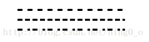
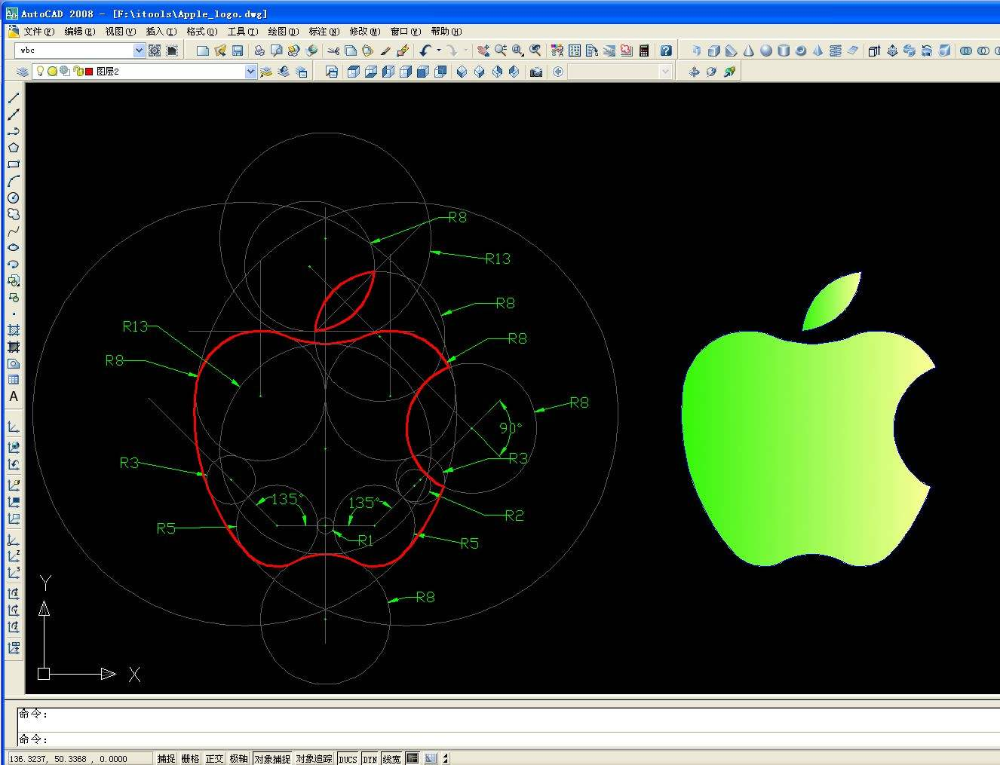
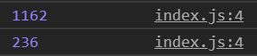

# 流动的 SVG 线条

**话不多说，咱先上效果图：**


是不是很酷炫，这个效果是用 SVG+CSS 实现的，现在我们就来一起解构一下这个动画的实现。

---

## 预备知识

### 需要掌握的几个 SVG 的几个标签用法

- &lt;path&gt;

  | 指令 | 参数                                                | 说明                                                                 |
  | ---- | --------------------------------------------------- | -------------------------------------------------------------------- |
  | M    | x y                                                 | 将画笔移动到点(x,y)                                                  |
  | L    | x y                                                 | 画笔从当前的点绘制线段到点(x,y)                                      |
  | H    | x                                                   | 画笔从当前的点绘制水平线段到点(x,y0)                                 |
  | V    | y                                                   | 画笔从当前的点绘制竖直线段到点(x0,y)                                 |
  | A    | rx ry x-axis-rotation large-arc-flag sweep-flag x y | 画笔从当前的点绘制一段圆弧到点(x,y)                                  |
  | C    | x1 y1, x2 y2, x y                                   | 画笔从当前的点绘制一段三次贝塞尔曲线到点(x,y)                        |
  | S    | x2 y2, x y                                          | 特殊版本的三次贝塞尔曲线(省略第一个控制点)                           |
  | Q    | x1 y1, x y                                          | 绘制二次贝塞尔曲线到点(x,y)                                          |
  | T    | x y                                                 | 特殊版本的二次贝塞尔曲线(省略控制点)                                 |
  | Z    | 无参数                                              | 绘制闭合图形，如果 d 属性不指定 Z 命令，则绘制线段，而不是封闭图形。 |

  _path 的指令一共有 9 种，但实现我们的动画我们只运用了其中两个：A 和 Z，所以我们这里着重讨论一下 A 指令！_

  **绘制圆弧指令：A rx ry x-axis-rotation large-arc-flag sweep-flag x y**

  > 对于给定两个点（一个起点一个终点）和一个半径，可以画 4 条弧线。这四条弧线可以按照两种分法：
  >
  > 1. 按角度分
  >    - 大于 180° 的
  >    - 小于 180° 的
  > 2. 按画笔方向分
  >    - 顺时针方向
  >    - 逆时针方向
  >
  > 

  - rx,ry 是弧的半长轴、半短轴长度
  - x-axis-rotation 是圆弧旋转角度，是此段弧所在的半长轴与水平方向的夹角。正数代表顺时针转动的角度。
  - large-arc-flag 为 1 表示大角度弧线，0 代表小角度弧线。
  - sweep-flag 为 1 代表从起点到终点弧线绕中心顺时针方向，0 代表逆时针方向。
  - x,y 是弧终端坐标。

- &lt;defs&gt;

  > SVG 允许我们定义以后需要重复使用的图形元素。 建议把所有需要再次使用的引用元素定义在`defs`元素里面。这样做可以增加 SVG 内容的易读性和可访问性。 在`defs`元素中定义的图形元素不会直接呈现。 你可以在你的视口的任意地方利用 [``](https://developer.mozilla.org/zh-CN/docs/Web/SVG/Element/use)元素呈现这些元素。——[MDN](https://developer.mozilla.org/zh-CN/docs/Web/SVG/Element/defs)

  这个标签的用意简单地说就是定义一个绘图模板，以供我们可以在别处直接使用。

  在这里我们可以定义我们的渐变元素：linearGradient。

- &lt;linearGradient&gt;

  > linearGradient 元素用来定义线性渐变，用于图形元素的填充或描边。——[MDN](https://developer.mozilla.org/zh-CN/docs/Web/SVG/Element/linearGradient)

  一个渐变上的颜色坡度，是用 stop 元素定义的。

  _例如：_

  ```html
  <stop offset="5%" stop-color="#F60" />
  ```

  _这行代码的意思是：在距离起点位置偏移 5%的地方颜色为 #F60。_

  **我们在引用自己定义的渐变进行填充颜色设置或画笔颜色设置时，仅需要用 url()的方式链入渐变的 ID 即可，具体如下：**

  ```html
  stroke="url(#linear)"
  ```

  _这里我们将画笔的颜色设置为了 ID 为 linear 的渐变。_

### 还有两个属性：

- stroke-dasharray

  **用于创建虚线：**

  ```css
  stroke-dasharray = '10'
  stroke-dasharray = '10, 10'
  stroke-dasharray = '10, 10, 5, 5'
  ```



_绘制虚线: 一个参数时： 表示一段虚线长度和每段虚线之间的间距_ 。

_两个参数或者多个参数时：一个表示长度，一个表示间距_

- stroke-dashoffset

  > stroke-dashoffset 属性指定了 dash 模式到路径开始的距离
  >
  > 如果使用了一个 百分比值， 那么这个值就代表了当前 viewport 的一个百分比。
  >
  > 值可以取为负值。——[MDN](https://developer.mozilla.org/zh-CN/docs/Web/SVG/Attribute/stroke-dashoffset)

  简单的讲，stroke-dashoffset 设置的是画笔起点的偏移量，正值向左偏移。

## 具体实现

### 画 SVG 路径

笔者通过描点，将网上下载下来的一张苹果图描出了 SVG，可能不大精确，但是应该够用。这里放一下我描点的图：



```
<path
  stroke-linecap="round"
  fill="none"
  stroke-width="10"
  stroke="url(#linear)"
  d="
M 197,148
A 87,87,0,0,0,79,214
A 282,282,0,0,0,148,438
A 54,54,0,0,0,212,448
A 87,87,0,0,1,288,448
A 54,54,0,0,0,352,438
A 282,282,0,0,0,407,350
A 87,87,0,0,1,413,189
A 87,87,0,0,0,303,148
A 141,141,0,0,1,197,148
Z
"
/>
<path
  stroke-linecap="round"
  fill="none"
  stroke="url(#linear)"
  stroke-width="10"
  d="
M 237,141
A 87,87,0,0,0,314,64
A 87,87,0,0,0,237,141
Z
"
/>
```

并且我将我的画笔颜色设置为即将编写的渐变 id。

### 定义渐变色

```html
<defs>
  <linearGradient id="linear" x1="0%" y1="0%" x2="100%" y2="100%">
    <stop offset="0%" stop-color="rgb(98, 180, 76)" />
    <stop offset="20%" stop-color="rgb(242, 179, 61)" />
    <stop offset="40%" stop-color="rgb(238, 125, 55)" />
    <stop offset="60%" stop-color="rgb(205, 58, 71)" />
    <stop offset="80%" stop-color="rgb(142, 61, 140)" />
    <stop offset="100%" stop-color="rgb(39, 155, 213)" />
  </linearGradient>
</defs>
```

为了显示为彩色，我设置了六个渐变颜色节点。

**值得注意的是：渐变颜色的即便应用在画笔上，他的填色还是按照面的颜色填充来填充的。就拿这个例子来说，我在 linearGradient 上定义了*x1="0%" y1="0%" x2="100%" y2="100%"*，使页面从左上角到右下角颜色显示为渐变，而不是路径的起点到终点的渐变，所以我们定义渐变在 0%和 100%的颜色并不需要一样。（实际上我们也不能定义从路径的起点到终点的渐变）**

### JavaScript 获取路径长度

```js
let pathLength = document.querySelectorAll("path");
pathLength.forEach((item, index) => {
  let itemLength = Math.ceil(item.getTotalLength());
  console.log(itemLength);
});
```



这里我们运用到了一个 JavaScript API：getTotalLength()，用于获取路径长度，方便我们设置偏移量。

### 设置动画

```css
path {
  animation: dash 5s linear forwards;
}
path:nth-child(2) {
  stroke-dasharray: 1162;
  stroke-dashoffset: -1162;
}
path:nth-child(3) {
  stroke-dasharray: 236;
  stroke-dashoffset: -236;
}
@keyframes dash {
  to {
    stroke-dashoffset: 0;
  }
}
```

我们的动画使从无到有的一个过程，所以我们将虚线长度和每段虚线之间的间距\*都设置为路径的长度。

在这种情况下我们显示的应该是完整的苹果 logo。

当我们设置 stroke-dashoffset 为路径长度的时候，那么我们就将画面的虚线部分完全隐藏在了画笔起点之前。整个画面将是空空如也！

这时候我们为两个 path 添加动画，让其在 5s 之内匀速的改变 stroke-dashoffset 至 0，那么呈现在我们眼前的就是如前面的动图所示，一个动态绘制 logo 的过程。

## 类似动画的其他实现

**先上效果图：**


**实现代码如下：**

```html
<svg
  xmlns="http://www.w3.org/2000/svg"
  width="200px"
  height="164.50px"
  class="icon"
  version="1.1"
  viewBox="0 0 1245 1024"
  id="logo-pic"
>
  <defs>
    <linearGradient id="linear" x1="0%" y1="0%" x2="100%" y2="0%">
      <stop offset="0%" stop-color="#05a" />
      <stop offset="100%" stop-color="#0a5" />
    </linearGradient>
  </defs>
  <path
    fill="url(#linear)"
    d="M870.953514 333.768649c-209.781622 0-374.867027 145.020541-374.867028 322.836756s165.223784 322.836757 374.867028 322.836757a548.116757 548.116757 0 0 0 132.289729-22.417297L1124.185946 1024l-33.210811-110.702703C1179.537297 845.768649 1245.405405 756.92973 1245.405405 656.605405c0-177.816216-176.294054-322.836757-374.451891-322.836756z m-121.496217 267.208648A47.463784 47.463784 0 0 1 705.72973 556.419459 47.740541 47.740541 0 0 1 749.457297 512c33.349189 0 55.351351 22.278919 55.351352 44.557838s-22.002162 44.419459-55.351352 44.419459z m242.438919 0a47.325405 47.325405 0 0 1-43.727567-44.557838A47.602162 47.602162 0 0 1 991.896216 512c33.072432 0 55.351351 22.278919 55.351352 44.557838s-22.278919 44.419459-55.351352 44.419459z"
  />
  <path
    fill="url(#linear)"
    d="M440.735135 0C198.434595 0 0 166.054054 0 378.326486c0 122.188108 66.006486 222.512432 176.432432 300.41946l-44.142702 133.811892 154.153513-77.907027c55.351351 10.931892 99.355676 22.278919 154.430271 22.278919 13.837838 0 27.675676 0 41.513513-1.798919a334.045405 334.045405 0 0 1-13.837838-93.267027c0-193.72973 166.054054-352.034595 374.728649-352.034595a378.88 378.88 0 0 1 42.482162 2.629189C847.429189 133.12 657.574054 0 440.735135 0zM294.192432 296.683243a53.137297 53.137297 0 1 1 52.722163-53.137297 52.860541 52.860541 0 0 1-52.722163 53.137297z m314.395676 0a53.137297 53.137297 0 1 1 52.722162-53.137297A52.860541 52.860541 0 0 1 608.864865 296.683243z"
  />
</svg>
<svg
  xmlns="http://www.w3.org/2000/svg"
  width="100%"
  height="2rem"
  id="logo-name"
>
  <text text-anchor="middle" x="50%" y="50%" class="logo logo-name-text-1">
    WeChat
  </text>
  <text text-anchor="middle" x="50%" y="50%" class="logo logo-name-text-2">
    WeChat
  </text>
  <text text-anchor="middle" x="50%" y="50%" class="logo logo-name-text-3">
    WeChat
  </text>
</svg>
```

_值得注意的是，在 SVG 中文字也可以将边框和填充分开来填色。所以这里我们将文字的边框设为最开始定义的渐变色，而填充设置为 none。_

```css
#logo-pic {
  width: 75px;
  height: 75px;
}
.logo {
  font-size: 1.25rem;
  font-weight: bold;
  fill: none;
  stroke-width: 1px;
  stroke-dasharray: 30% 70%;
  animation: stroke 4.5s infinite linear;
}
.logo-name-text-1 {
  stroke: rgb(0, 169, 86);
}
.logo-name-text-2 {
  stroke: rgb(0, 127, 129);
  animation-delay: -1.5s;
}
.logo-name-text-3 {
  stroke: rgb(0, 86, 168);
  animation-delay: -3s;
}
@keyframes stroke {
  to {
    stroke-dashoffset: -100%;
  }
}
```

---

笔者专门在 github 上创建了一个仓库，用于记录平时学习全栈开发中的技巧、难点、易错点，欢迎大家点击下方链接浏览。如果觉得还不错，就请给个小星星吧！👍

---

2019/04/02

[AJie](https://github.com/KevinSalvatore/FullStackPoints.git)
