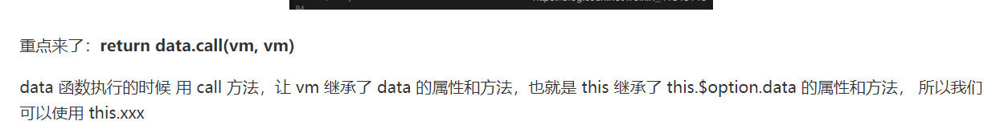

# Vue-js 源码解读系列——this 直接调用数据源

## 前言

今天看到一篇文章：[为什么 Vue 实例化后，通过 this.能获取到 data 内的数据](https://www.jianshu.com/p/91ed1ce034c2)

一下是这篇文章的结论：

> 不卖关子啦！其实 Vue 实例化的时候，通过 getData 方法中 call 修改 this 指针来实现 Vue 实例后能获取到 data 体内的数据，小伙伴可能感觉认为我将 vue 初始化部分流程拉出来是的你越来越糊涂，但是如果我不讲上面的代码拉出来，我直接来这句总结，你会更加懵的 🙂🙂🙂

这篇文章根本没有说清楚，或者说根本就说错了。可能不知道误导了多少人，而且网上对于该问题的解释都一致的看向源码中的：

```javascript
return data.call(vm, vm);
```



图片截至：[Vue 源码解析：this.\$data、this.\_data、this.xxx 为什么都能获取数据？data 为什么是个函数？](https://blog.csdn.net/weixin_41845146/article/details/85257924)

然而实现该功能的其实并不是这句话！！！

然而实现该功能的其实并不是这句话！！！

然而实现该功能的其实并不是这句话！！！

（重要的事情说三遍！）

## 源码分析

首先得从 Vue 的实例化开始看起！

```javascript
function Vue(options) {
  if (process.env.NODE_ENV !== "production" && !(this instanceof Vue)) {
    warn("Vue is a constructor and should be called with the `new` keyword");
  }
  this._init(options);
}
```

在这段代码中，对我们实际有用的是：this.\_init(options)

```javascript
Vue.prototype._init = function (options?: Object) {
    const vm: Component = this
    ...
    if (options && options._isComponent) {
      initInternalComponent(vm, options)
    } else {
      vm.$options = mergeOptions(
        resolveConstructorOptions(vm.constructor),
        options || {},
        vm
      )
    }
    ...
    initState(vm)
  	...
}
```

在 Vue.prototype.\_init() 中，要注意的是：

- 先将当前对象保存为了一个常量 vm
- 其次设置了 vm.\$options 属性，写入了向 Vue 对象创建时传入的 options 对象（这里不做详解）
- 并且通过 initState(vm)做相关初始化操作

```javascript
export function initState (vm: Component) {
	...
  const opts = vm.$options
	...
  if (opts.data) {
    initData(vm)
  } else {
    observe(vm._data = {}, true /* asRootData */)
  }
	...
}
```

在这段代码中，如果 vm.\$options.data（也就是我们的数据源）如果有数据，我们就进行 initData(vm)操作，传入的 vm 即当前 Vue 对象！

```javascript
function initData (vm: Component) {
  let data = vm.$options.data
  data = vm._data = typeof data === 'function'
    ? getData(data, vm)
    : data || {}
	...
  // proxy data on instance
  const keys = Object.keys(data)
	...
  let i = keys.length
  while (i--) {
    const key = keys[i]
    ...
    proxy(vm, `_data`, key)
  }
	...
}
```

值得注意的是：

我们实例化 Vue 数据源的时候写法常常是：

```javascript
data: function() {
  return {
    key: value,
    ...
  }
}
```

那么这时候我们就会走向`data = vm._data = getData(data, vm)`

```javascript
export function getData (data: Function, vm: Component): any {
	...
  return data.call(vm, vm)
	...
}
```

这里我们就要理解一下，data.call(vm, vm)到底干了啥？

对于 call 的深入理解建议阅读一下：[对于 Function.call()的深入理解](https://juejin.im/post/5c9d9924e51d45653a0efc20)

这里我将简单地进行解释：

```javascript
data.call(vm, vm)
// 实际上与是以如下方式运行的
vm.data(vm)

//假如我们有如下数据源
data: function() {
  return {
    content: "Hello World!"
  }
}
//那么data.call(vm, vm)执行的实际上就是得到了return中的对象
{
  content: "Hello World!"
}
```

data.call(vm, vm) 并没有实现我们想要的功能。

```javascript
data = vm._data = typeof data === "function" ? getData(data, vm) : data || {};
```

这段代码的意思实际上是：无论我们定义的 data 是一个 function 还是一个{}，最终都将返回一个{}并且赋值给 data 这个变量！

**值得注意：**vm.\_data 就是返回的{}，可以在控制的进行打印输出看一看，和 vm.\$data 的值是一样的！

那么真正的实现在哪呢？

我们看到 initData()函数的后半段代码：

```javascript
const keys = Object.keys(data)
...
let i = keys.length
while (i--) {
  const key = keys[i]
  ...
  proxy(vm, `_data`, key)
}
```

这里遍历了我们之前所取到的 data，对其中每一个属性都进行了`proxy(vm,`\_data`, key)`调用。

```javascript
const sharedPropertyDefinition = {
  enumerable: true,
  configurable: true,
  get: noop,
  set: noop
};

export function proxy(target: Object, sourceKey: string, key: string) {
  sharedPropertyDefinition.get = function proxyGetter() {
    return this[sourceKey][key];
  };
  sharedPropertyDefinition.set = function proxySetter(val) {
    this[sourceKey][key] = val;
  };
  Object.defineProperty(target, key, sharedPropertyDefinition);
}
```

理解这段代码，这里得先普及一个知识点：

> [Object.defineProperty()](https://developer.mozilla.org/zh-CN/docs/Web/JavaScript/Reference/Global_Objects/Object/defineProperty)
>
> 方法会直接在一个对象上定义一个新属性，或者修改一个对象的现有属性， 并返回这个对象。

通过 defineProperty()实际上就是给 Vue 实例定义了新的属性！！！

这才是重点，这里通过遍历 data，将 data 中的属性/值绑定在了 vm（也就是 Vue 实例）上。

在 proxy()中的传入的第二个参数`_data`，实际上为了后面`this[sourceKey][key]`调用 vm.\_data（前面有提）中的的属性/值。

这里通过 vm 上创建新属性，并且采用 set，get 属性描述符使得每一次改变数据都会直接作用于 vm.\_data 之上。

## 结语

其实今天的话题在 Vue.js 的文档就有解释：

> ### [data](https://cn.vuejs.org/v2/api/#data)
>
> - **类型**：`Object | Function`
>
> - **限制**：组件的定义只接受 `function`。
>
> - **详细**：
>
>   Vue 实例的数据对象。Vue 将会递归将 data 的属性转换为 getter/setter，从而让 data 的属性能够响应数据变化。**对象必须是纯粹的对象 (含有零个或多个的 key/value 对)**：浏览器 API 创建的原生对象，原型上的属性会被忽略。大概来说，data 应该只能是数据 - 不推荐观察拥有状态行为的对象。
>
>   一旦观察过，不需要再次在数据对象上添加响应式属性。因此推荐在创建实例之前，就声明所有的根级响应式属性。
>
>   实例创建之后，可以通过 `vm.$data` 访问原始数据对象。Vue 实例也代理了 data 对象上所有的属性，因此访问 `vm.a` 等价于访问 `vm.$data.a`。
>
>   以 `_` 或 `$` 开头的属性 **不会** 被 Vue 实例代理，因为它们可能和 Vue 内置的属性、API 方法冲突。你可以使用例如 `vm.$data._property` 的方式访问这些属性。
>
>   当一个**组件**被定义，`data` 必须声明为返回一个初始数据对象的函数，因为组件可能被用来创建多个实例。如果 `data` 仍然是一个纯粹的对象，则所有的实例将**共享引用**同一个数据对象！通过提供 `data` 函数，每次创建一个新实例后，我们能够调用 `data` 函数，从而返回初始数据的一个全新副本数据对象。
>
>   如果需要，可以通过将 `vm.$data` 传入 `JSON.parse(JSON.stringify(...))` 得到深拷贝的原始数据对象。

所以说，遇到问题要多看文档，实在不行再看源码！

-EFO-

---

笔者专门在 github 上创建了一个仓库，用于记录平时学习全栈开发中的技巧、难点、易错点，欢迎大家点击下方链接浏览。如果觉得还不错，就请给个小星星吧！👍

---

2019/05/27

[AJie](https://github.com/KevinSalvatore/FullStackPoints.git)
