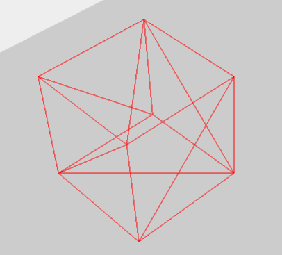
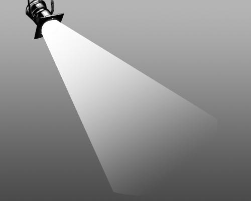
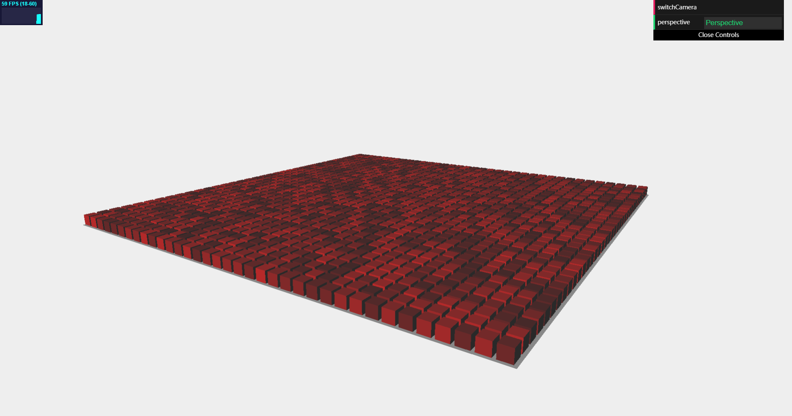
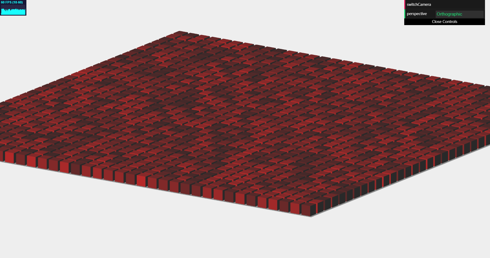
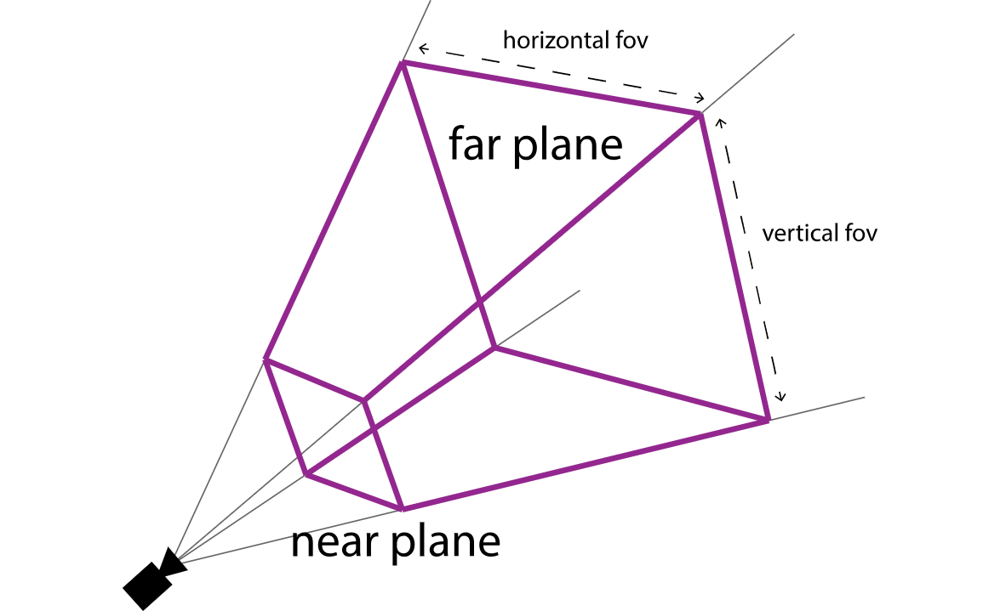
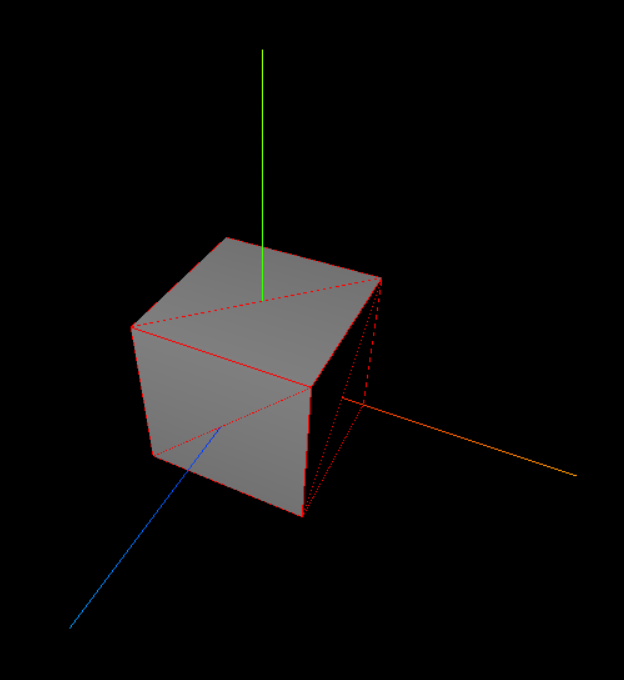
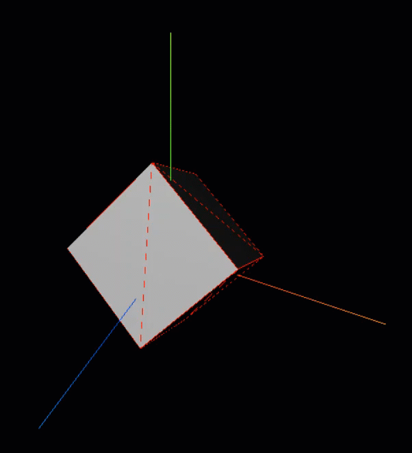

# 一只脚踏入 Three.js

## 前言

正所谓：无折腾，不前端。不搞 WebGL，和咸鱼有啥区别！

用官方的说法：Three.js - Javascript 3D library。

我们今天就来一起熟悉一下 Three.js 的设计理念与思想。

## 笛卡尔右手坐标系

在做 3D，我们首先得要了解其基本准则：三维坐标系。

我们都知道在 CSS3 的三维空间中是左手坐标系。（如果不了解的可以阅读我之前写的一篇文章[《CSS3 之 3D 变换》](https://juejin.im/post/5c9e67f16fb9a05e4c0e5eb0)）

但是在 Three.js 中，我们的空间是基于右手笛卡尔坐标系的而展现的。如下：


了解了坐标系之后，我们就能在这片三维空间中创建我们想要的场景了。

## 创建场景

> 想要使用三维空间，首先就必须开辟一个三维空间这一容器。而开辟一个三维空间只需要实例化 THREE.Scene 这一对象就可以了。
>
> ```javascript
> var scene = new THREE.Scene();
> ```
>
> 场景是你可以放置物体、相机和灯光的三维空间，如同宇宙一般，没有边界，也没有光亮，有的是无尽的黑暗。

**一个场景中的组件可以的大致分为三类：摄像机、光源、对象。**

我们在了解 Thee.js 中的组件之前，先看一张照片：


_这是一张拍摄商品的工作室照片。这张照片就基本可以说明我们 Three.js 的 3D 设计模式：我们在有了一个空间之后，我们需要将我们是拍摄对象放进去。有了对象之后我们还需要设置至少一个光源，这样我们才能看到我们的拍摄对象。最后，我们呈现在客户眼前的是一系列由相机拍摄出的照片连续播放产生的动画，相机的参数、位置和角度直接影响着我们所拍到的图片。_

### 拍摄对象

在使用拍摄对象之前我们先说明一下用 Three.js 创建拍摄对象的设计模式：

首先 Three.js 将任何拍摄对象解构为一个个小三角形。无论是二维图形还是三维图形，都可以用三角形作为结构最小单位。而结构出来的就是我们拍摄对象的一个网格。

如下呈现的是二维平面的网格结构：


如下展示的是三维球体网格结构：


可以看到在 Three.js 中三角形是最小分割单位。这就是网格结构。

当然有网格结构还是不够的。就像人体一样，因为网格结构就像是骨架，在其外表还需要材质。材质就是物体的皮肤，决定着几何体的外表。

#### 几何体模型（Geometry）

在 Three.js 中，为我们预设了很多几何体的网格结构：

- 二维：

  - THREE.PlaneGeometry（平面）

    这个几何体在前文已经展示过了。

  - THREE.CircleGeometry（圆）

    

  - THREE.RingGeometry（环）

    

- 三维

  - THREE.BoxGeometry（长方体）

    

  - THREE.SphereGeometry（球体）

    这个几何体在前文已经展示过了。

  - THREE.CylinderGeometry（圆柱体）

    

  - THREE.Torus（圆环）

    

以上所举的只是内置几何体的一部分。我们在使用这些集合体的时候，我们只需要实例化相应几何体对象即可。

具体我们以实例化一个正方体为例：

```javascript
var geometry = new THREE.BoxGeometry(4, 4, 4);
```

这里我们先声明并且实例化了一个 BoxGeometry（长方体）对象。在创建对象的时候我们分别设置了长、宽、高各为 4。

这样一个正方体就创建好了。但是有了这么一个网格框架是远远不够的。下一步就是给他添加材质。

#### 材质（Material）

在材质组件中，Three.js 也为我们预设了几种材质对象，我们这里简单的介绍两种最常用的：

1. MeshBasicMaterial

   这一材质，是 Three.js 的基础材质。用于给几何体网格赋予一种简单的颜色或是显示几何体的网格结构。（即便在没有光源的情况下也可以显示。）

2. MeshLambertMaterial

   这是一种考虑光照影响的材质。用于创建暗淡的，不光亮的物体。

值得注意的是，在同一个网格结构中我们可以多种材质进行叠加。

这里我们先后使用 MeshBasicMaterial 和 MeshLambertMaterial 为我们前文所创造的正方体准备两个不同的材质：

```javascript
var geometryMeshBasicMaterial = new THREE.MeshBasicMaterial({
  color: 0xff0000,
  wireframe: true
});
var geometryMeshLambertMaterial = new THREE.MeshLambertMaterial({
  color: 0x242424
});
```

其中 wireframe 属性当设置为 true 的时候，将会将材质渲染为线宽。相框可以变相的理解为网格线。比如说一个正方体的线框如下：



#### 网格（Mesh）

当我们拥有了几何体网格模型和材质之后我们就需要将两者结合起来创建我们正在的拍摄对象。

这里我们介绍两个不同的拍摄对象构造方法：

- new THREE.Mesh(geometry, material)
- THREE.SceneUtils.createMultiMaterialObject(geometry,[materials...])

这两种都是创建拍摄对象的方法，且第一个参数都是几何体模型（Geometry），唯一不同在于第二个参数。前者只能用一种材质创建拍摄对象，后者可以使用多种材质进行创建（传入一个包含多种材质的数组）。

这里我们将创建一个多材质拍摄对象。

```javascript
var cube = THREE.SceneUtils.createMultiMaterialObject(geometry, [
  geometryMeshBasicMaterial,
  geometryMeshLambertMaterial
]);
```

现在我们已经有一个拍摄对象了，这时候我们需要将我们的对象添加到场景中，就像我们在拍摄商品一样，得要把我们的商品放在拍摄空间之中。

在 Three.js 中，向场景中添加对象可以直接通过场景对象调用 add 方法实现。具体实现如下：

```javascript
scene.add(cube);
```

我们向 add()方法内传入我们要添加的对象，可以是一个，也可以多个，用逗号隔开。

### 光源

和现实生活中的逻辑是一样的，物体本身是不会发光的。如果没有太阳这一光源，地球将陷入无尽的黑暗，啥也瞅不着。所以我们也要向我们的场景中添加光源对象。

在 Three.js 中，光源分为了好几种，接下来将简单的介绍其中用的比较多的几种。

1. THREE.AmbientLight

   这是一种基本光源，该光源将会叠加到场景现有物体的颜色上。

   该光源没有特定的来源方向，且不会产生阴影。

   我们经常在使用了其他光源的同时使用它，是为了弱化阴影或给场景添加一些额外的颜色。

2. THREE.SpotLight

   

   这种光源有聚光的效果，类似台灯、手电筒、舞台聚光灯。

   这种光源可以投射阴影。

3. THREE.DirectionalLight

   这种光源也称为无限光，类似太阳光。

   这种光源发出的光线可以看作是平行的。

   这种光源也可投射阴影。

在我们的例子中，我们将用 SpotLight 来创建我们的灯光。

首先我们要和之前常见拍摄对象一样，先实例化一个 SpotLight 对象，并且以一个十六进制的颜色值作为传参，作为我们灯光的颜色。

```javascript
var spotLight = new THREE.SpotLight(0xffffff);
spotLight.position.set(0, 20, 20);
spotLight.intensity = 5;
scene.add(spotLight);
```

在拥有光源对象之后，我们将调用 position.set()方法设置在三维空间中的位置。

intensity 属性用于设置光源照射的强度，默认值为 1。

最后我们也得将光源放进我们的场景空间之中。这样我们的场景就有了一个 SpotLight 光源了。

### 摄像机

在 THREE.js 中有两种相机：

- THREE.PerspectiveCamera（透视相机）

  符合近大远小的常理。用接近真实世界的视角来渲染场景。

  

- THREE.OrthographicCamera（正交相机）

  提供了一个伪三维效果。

  

可以看的出来：透视相机更贴近我们现实生活中人眼所观察到的世界，而正交相机渲染的结果和对象相距相机距离的远近没有影响。

**这里我将着重介绍一下 PerspectiveCamera：**

我们先来看一张图：



对于一个透视相机来说，我们需要设定以下几个参数：

- fov（视场）是`竖直方向`上的张角（是角度制而非弧度制）
- aspect（长宽比）是照相机水平方向和竖直方向长度的比值
- near（近面距离）相机到视景体最近的距离
- far（远面距离）相机到视景体最远的距离
- zoom（变焦）

这里我们也将创建一个我们自己的透视相机。

```javascript
var camera = new THREE.PerspectiveCamera(
  75,
  window.innerWidth / window.innerHeight,
  0.1,
  1000
);
camera.position.x = 5;
camera.position.y = 10;
camera.position.z = 10;
camera.lookAt(cube.position);
```

首先我们在实例化透视相机对象的时候，向其内部传递了几个参数：竖直方向上的张角为 75 度，长宽比与窗口相同，相机到视景体最近、最远的距离分别为 0.1 和 1000。

最后我们让相机通过调用 lookAt()方法，看向我们之前创建的拍摄对象 cube 的位置上。（默认状态下，相机将指向三维坐标系的原点。）

## 渲染器（Renderer）

在有了以上的这些对象之后，我们离成功之差区区几步了。

在看到这一部分的标题的时候，你可能会问：什么是渲染器？

通俗地说：我们用相机拍到的是底片，还不是真正的相片。如果你还对老式相机有所印象，这一点将不难理解。

当我们拿着一台老式相机（还需要胶卷的那种）我们每拍一张都将得到一张底片。我们想要拿到正真的相片还需要带着底片，前往照相馆去洗出来。这时候老板会问你你要洗多大的相片，然后依据你的需求洗出你想要的相片。

可以说这就是渲染器的作用——洗相片。还记得我们之前在设置相机的参数的时候，我们并没有设定相机的宽高，而是只指定了相机的长宽比。这就像我们的底片一样，虽然小，但是却显示了我们相片的基本长宽比。

我们创建渲染器的方法和创建 THREE 中的其他对象一样，都需要先将对象实例化。

Three.js 为我们提供了好几种不同的渲染器这里我们将使用 THREE.WebGLRenderer 渲染器作为例子。

```javascript
var renderer = new THREE.WebGLRenderer();
renderer.setSize(window.innerWidth, window.innerHeight);
document.body.appendChild(renderer.domElement);
renderer.render(scene, camera);
```

- 我们通过调用 setSize() 方法设置渲染的长宽。
- 渲染器 renderer 的 domElement 元素，表示渲染器中的画布，所有的渲染都是画在 domElement 上的，所以这里的 appendChild 表示将这个 domElement 挂接在 body 下面，这样渲染的结果就能够在页面中显示了。
- render()方法中传递我们的场景和相机，相当于传递了一张由相机拍摄场景得到的一张底片，它将将图像渲染到我们的画布中。

这时候你将得到一个如下形状：



> 这里我们为了方便观察，添加了坐标系对象。
>
> 与一般对象一样，我们通过实例化该对象，并向其内传递一个轴长参数，最后添加进我们的场景之中。
>
> ```javascript
> var axes = new THREE.AxisHelper(7);
> scene.add(axes);
> ```
>
> 这里我们的坐标系轴长设置为 7。

这时候你会发现这张图片还是静态的，3D 的特性还没有完全发挥出来。

## 动画（Animation）

在讲解动画之前我们需要科普几个知识点，实际上扯远了一点，不过会有助于我们去理解动画的渲染，提高性能。

### 理解 Event Loop

异步执行的运行机制如下：

1. 所有同步任务都在主线程上执行，形成一个执行栈（execution context stack）。
2. 主线程之外，还存在一个“任务队列”（task queue）。只要满足异步任务的执行条件，就在“任务队列”之中`放置一个事件`。
3. 一旦“执行栈”中的所有同步任务执行完毕，系统就会读取“任务队列”，看看里面有哪些事件。那些对应的异步任务，于是结束等待状态，进入执行栈，开始执行。

主线程不断重复上面的第三步。主线程从“任务队列”中读取事件，这个过程是循环不断的，所以整个的这种运行机制又称为 Event Loop（事件循环）。只要主线程空了，就会去读取“任务队列”，这就是 JavaScript 的运行机制。这个过程会循环反复。

### 动画原理

动画实际上是由一些列的图片在一定时间内，以一定的频率播放而产生的错觉。

眼睛的一个重要特性是视觉惰性，即光象一旦在视网膜上形成，视觉将会对这个光象的感觉维持一个有限的时间，这种生理现象叫做视觉暂留性。对于中等亮度的光刺激，视觉暂留时间约为 0.1 至 0.4 秒。

为了让动画连贯的、平滑的方式进行过渡，一般我们以 60 帧每秒甚至更高的速率渲染动画。

### 为什么不用 setInterval() 实现动画？

- setInterval()的执行时间并不是确定的。在 Javascript 中， setInterval()任务被放进了异步队列中，只有当主线程上的任务执行完以后，才会去检查该队列里的任务是否需要开始执行，因此 **setInterval()的实际执行时间一般要比其设定的时间晚一些。**
- setInterval()只能设置一个固定的时间间隔，这个时间不一定和屏幕的刷新时间相同。

以上两种情况都会导致 setInterval()的执行步调和屏幕的刷新步调不一致，从而引起**丢帧**现象。 那为什么步调不一致就会引起丢帧呢？

首先要明白，setInterval()的执行只是在内存中对图像属性进行改变，这个变化必须要等到屏幕下次刷新时才会被更新到屏幕上。如果两者的步调不一致，就可能会导致中间某一帧的操作被跨越过去，而直接更新下一帧的图像。假设屏幕每隔 16.7ms 刷新一次（60 帧），而 setInterval()每隔 10ms 设置图像向左移动 1px， 就会出现如下绘制过程：

- 第 0ms: 屏幕未刷新，等待中，setInterval()也未执行，等待中；
- 第 10ms: 屏幕未刷新，等待中，setInterval()开始执行并设置图像属性 left=1px；
- 第 16.7ms: 屏幕开始刷新，屏幕上的图像向左移动了**1px**， setInterval()未执行，继续等待中；
- 第 20ms: 屏幕未刷新，等待中，setInterval()开始执行并设置 left=2px;
- 第 30ms: 屏幕未刷新，等待中，setInterval()开始执行并设置 left=3px;
- 第 33.4ms:屏幕开始刷新，屏幕上的图像向左移动了**3px**， setInterval()未执行，继续等待中；
- …

从上面的绘制过程中可以看出，屏幕没有更新 left=2px 的那一帧画面，图像直接从 1px 的位置跳到了 3px 的的位置，这就是丢帧现象，这种现象就会引起动画卡顿。

### requestAnimationFrame()

#### requestAnimationFrame()的优势

与 setInterval()相比，requestAnimationFrame()最大的优势是**由系统来决定回调函数的执行时机。**具体一点讲，如果屏幕刷新率是 60 帧，那么回调函数就每 16.7ms 被执行一次，如果刷新率是 75Hz，那么这个时间间隔就变成了 1000/75=13.3ms，换句话说就是，requestAnimationFrame()的步伐跟着系统的刷新步伐走。**它能保证回调函数在屏幕每一次的刷新间隔中只被执行一次**，这样就不会引起丢帧现象，也不会导致动画出现卡顿的问题。

除此之外，requestAnimationFrame()还有以下两个优势：

- **CPU 节能**：使用 setInterval()实现的动画，当页面被隐藏或最小化时，setInterval()仍然在后台执行动画任务，由于此时页面处于不可见或不可用状态，刷新动画是没有意义的，完全是浪费 CPU 资源。而 requestAnimationFrame()则完全不同，当页面处理未激活的状态下，该页面的屏幕刷新任务也会被系统暂停，因此跟着系统步伐走的 requestAnimationFrame()也会停止渲染，当页面被激活时，动画就从上次停留的地方继续执行，有效节省了 CPU 开销。

- **函数节流**：在高频率事件(resize,scroll 等)中，为了防止在一个刷新间隔内发生多次函数执行，使用 requestAnimationFrame()可保证每个刷新间隔内，函数只被执行一次，这样既能保证流畅性，也能更好的节省函数执行的开销。一个刷新间隔内函数执行多次时没有意义的，因为显示器每 16.7ms 刷新一次，多次绘制并不会在屏幕上体现出来。

#### requestAnimationFrame()的工作原理：

先来看看 Chrome 源码：

```java
int Document::requestAnimationFrame(PassRefPtr<RequestAnimationFrameCallback> callback)
{
  if (!m_scriptedAnimationController) {
    m_scriptedAnimationController = ScriptedAnimationController::create(this);
    // We need to make sure that we don't start up the animation controller on a background tab, for example.
      if (!page())
        m_scriptedAnimationController->suspend();
  }

  return m_scriptedAnimationController->registerCallback(callback);
}
```

仔细看看就觉得底层实现意外地简单，生成一个 ScriptedAnimationController 的实例用于存放注册事件，然后注册这个 callback。

requestAnimationFrame 的实现原理就很明显了：

- 注册回调函数
- 浏览器按一定帧率更新时会触发 触发所有注册过的 callback

这里的工作机制可以理解为所有权的转移，把触发帧更新的时间所有权交给浏览器内核，与浏览器的更新保持同步。这样做既可以避免浏览器更新与动画帧更新的不同步，又可以给予浏览器足够大的优化空间。

#### 用 requestAnimationFrame()创建动画

我们需要创建一个循环渲染函数，并且进行调用：

```javascript
// a render loop
function render() {
  requestAnimationFrame(render);

  // Update Properties

  // render the scene
  renderer.render(scene, camera);
}
```

我们在函数体内部进行相应的属性更新并渲染，并且让浏览器来控制动画帧的更新。

### 制作动画

这里我们将通过 requestAnimationFrame() 来创建我们的动画效果。让浏览器来控制动画帧的更新最大的提高我们的性能。

```javascript
var animate = function() {
  requestAnimationFrame(animate);
  cube.rotation.x += 0.01;
  cube.rotation.y += 0.01;
  renderer.render(scene, camera);
};
animate();
```

我们在 animate()方法中，通过 requestAnimationFrame(animate)来使浏览器在每次更新页面的时候调用 animate 方法。且每调用一次，正方体的属性就作出相应的改变：每一次调用都比上一次 X 轴、Y 轴各旋转 0.01 弧度，并且将其渲染到画布上。

这样我们的动画就产生了：



## THREE.Color 对象

这里我在补充说明一下 Three.js 内置的颜色对象。

通常情况下，我们可以使用十六进制的字符串（"#000000"）或十六进制值（0x000000）来创建指定颜色对象。我们也可以用 RGB 颜色值来创建（0.2, 0.3, 0.4），但值得注意的是其每个值的范围为 0 到 1。

例如：

```javascript
var color = new THREE.Color(0x000000);
```

在创建颜色对象之后，我们可以对用其自身的一些方法，这里就不详细介绍了：

| 函数名                 | 描述                                                                                                             |
| ---------------------- | ---------------------------------------------------------------------------------------------------------------- |
| set(value)             | 将当前颜色设置为指定的十六进制值。这个值可以是字符串、数值或是已有的 THREE.Color 实例。                          |
| setHex(value)          | 将当前颜色设置为指定的十六进制数字值。                                                                           |
| setRGB(r,g,b)          | 根据提供的 RGB 值设置颜色。参数范围从 0 到 1。                                                                   |
| setHSL(h,s,l)          | 根据提供的 HSL 值设置颜色。参数范围从 0 到 1。                                                                   |
| setStyle(style)        | 根据 css 设置颜色的方式来设置颜色。例如：可以使用 "rgb(25, 0, 0)"、"#ff0000"、"#ff" 或 "red"。                   |
| copy(color)            | 从提供的颜色对象复制颜色值到当前对象。                                                                           |
| getHex()               | 以十六进制值形式从颜色对象中获取颜色值：435241。                                                                 |
| getHexString()         | 以十六进制字符串形式从颜色对象中获取颜色值："0c0c0c"。                                                           |
| getStyle()             | 以 css 值的形式从颜色对象中获取颜色值："rgb(112, 0, 0)"                                                          |
| getHSL(optionalTarget) | 以 HSL 值的形式从颜色对象中获取颜色值。如果提供了 optionTarget 对象， Three.js 将把 h、s 和 l 属性设置到该对象。 |
| toArray                | 返回三个元素的数组：[r,g,b]。                                                                                    |
| clone()                | 复制当前颜色。                                                                                                   |

## 总结

可以这么说：

Three.js 的一切都建立在 Scene 对象之上。有了场景这一空间之后，我们就可以往里面添加我们要展示的拍摄对象了。当然有了拍摄对象之后我们还需要一个光源，让我们看的见我们的对象。这时候我们还需要一个相机，用以拍摄我们的拍摄对象。当然我们实际还需要靠我们的渲染器将实际图像绘制在画布上。

通过不断变换对象的属性，并且不断地绘制我们的场景，这就产生了动画！

## 附源码

```html
<html>
  <head>
    <title>Cube</title>
    <style>
      body {
        margin: 0;
        overflow: hidden;
      }

      canvas {
        width: 100%;
        height: 100%;
      }
    </style>
  </head>

  <body>
    <script src="https://cdn.bootcss.com/three.js/r83/three.min.js"></script>
    <script>
      var scene = new THREE.Scene();

      var axes = new THREE.AxisHelper(7);
      scene.add(axes);

      var geometry = new THREE.BoxGeometry(4, 4, 4);
      var geometryMeshBasicMaterial = new THREE.MeshBasicMaterial({
        color: 0xff0000,
        wireframe: true
      });
      var geometryMeshLambertMaterial = new THREE.MeshLambertMaterial({
        color: 0x242424
      });
      var cube = THREE.SceneUtils.createMultiMaterialObject(geometry, [
        geometryMeshBasicMaterial,
        geometryMeshLambertMaterial
      ]);
      scene.add(cube);

      var spotLight = new THREE.SpotLight(0xffffff);
      spotLight.position.set(0, 20, 20);
      spotLight.intensity = 5;
      scene.add(spotLight);

      var camera = new THREE.PerspectiveCamera(
        75,
        window.innerWidth / window.innerHeight,
        0.1,
        1000
      );
      camera.position.x = 5;
      camera.position.y = 10;
      camera.position.z = 10;
      camera.lookAt(cube.position);

      var renderer = new THREE.WebGLRenderer();
      renderer.setSize(window.innerWidth, window.innerHeight);
      document.body.appendChild(renderer.domElement);

      var animate = function() {
        requestAnimationFrame(animate);
        cube.rotation.x += 0.01;
        cube.rotation.y += 0.01;
        renderer.render(scene, camera);
      };
      animate();
    </script>
  </body>
</html>
```

-EFO-

---

笔者专门在 github 上创建了一个仓库，用于记录平时学习全栈开发中的技巧、难点、易错点，欢迎大家点击下方链接浏览。如果觉得还不错，就请给个小星星吧！👍

---

2019/04/14

[AJie](https://github.com/KevinSalvatore/FullStackPoints.git)
