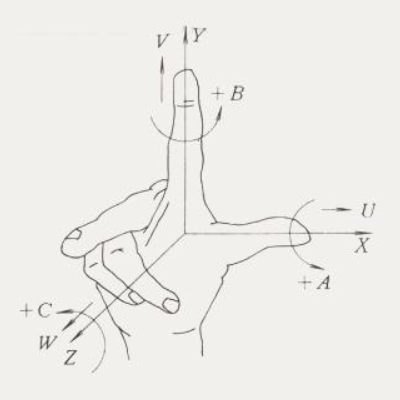
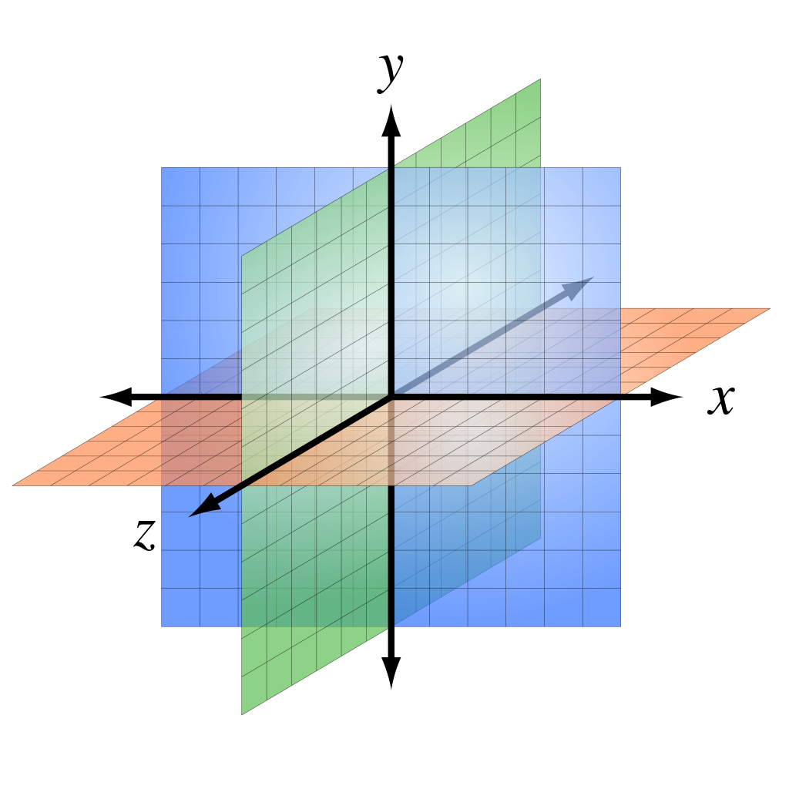
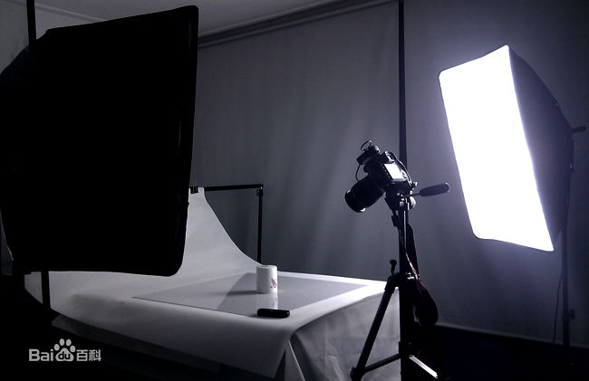
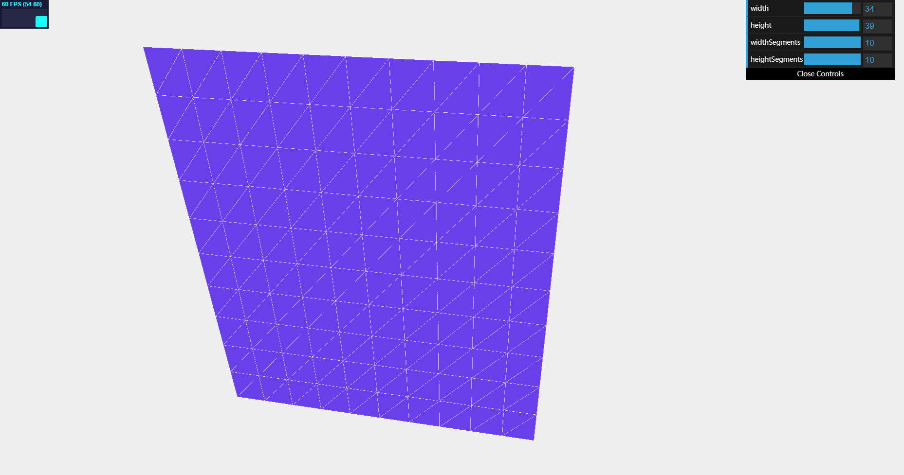
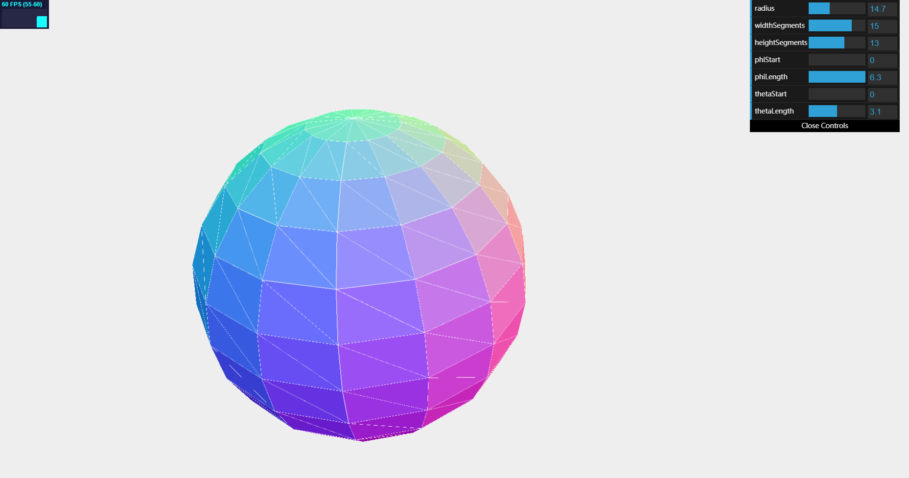
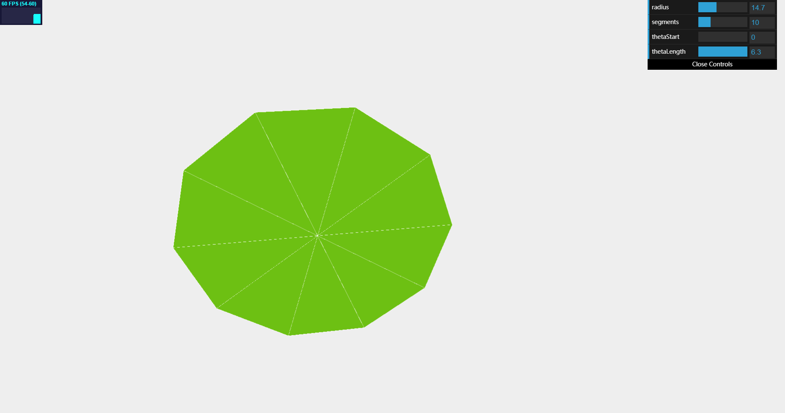
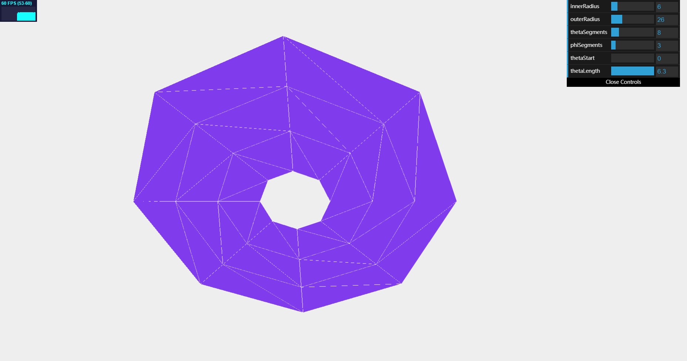
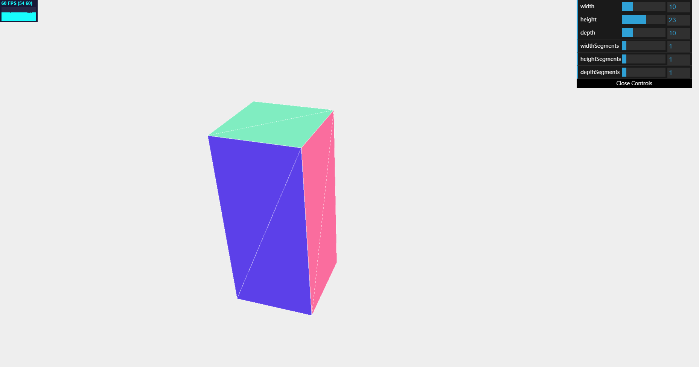
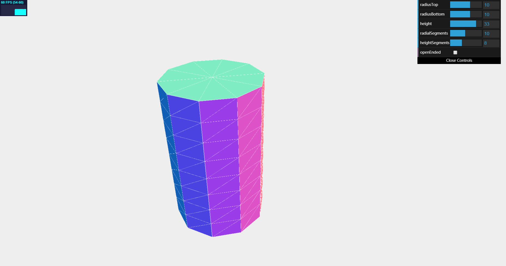
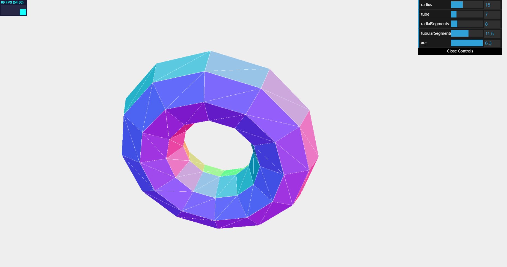

# 一只脚踏入 Three.js

## 前言

正所谓：无折腾，不前端。不搞WebGL，和咸鱼有啥区别！

用官方的说法：Three.js - Javascript 3D library。

我们今天就来一起熟悉一下Three.js 的设计理念与思想。

## 笛卡尔右手坐标系

在做3D，我们首先得要了解其基本准则：三维坐标系。

我们都知道在CSS3的三维空间中是左手坐标系。（如果不了解的可以阅读我之前写的一篇文章[《CSS3 之 3D 变换》](https://juejin.im/post/5c9e67f16fb9a05e4c0e5eb0)）

但是在Three.js中，我们的空间是基于右手笛卡尔坐标系的而展现的。如下：





了解了坐标系之后，我们就能在这片三维空间中创建我们想要的场景了。

## 创建场景

> 想要使用三维空间，首先就必须开辟一个三维空间这一容器。而开辟一个三维空间只需要实例化THREE.Scene这一对象就可以了。
>
> ```javascript
> var scene = new THREE.Scene();
> ```
>
> 场景是你可以放置物体、相机和灯光的三维空间，如同宇宙一般，没有边界，也没有光亮，有的是无尽的黑暗。

**一个场景中的组件可以的大致分为三类：摄像机、光源、对象。**

我们在了解Thee.js中的组件之前，先看一张照片：



*这张照片就基本可以说明我们Three.js 的3D设计模式：我们在有了一个空间之后，我们需要将我们是拍摄对象放进去。有了对象之后我们还需要设置至少一个光源，这样我们才能看到我们的拍摄对象。最后，我们呈现在客户眼前的是一系列由相机拍摄出的照片连续播放产生的动画，相机的参数、位置和角度直接影响着我们所拍到的图片。*

### 拍摄对象

在使用拍摄对象之前我们先说明一下用Three.js创建拍摄对象的设计模式：

首先Three.js 将任何拍摄对象解构为一个个小三角形。无论是二维图形还是三维图形，都可以用三角形作为结构最小单位。而结构出来的就是我们拍摄对象的一个网格。

如下呈现的是二维平面的网格结构：



如下展示的是三维球体网格结构：



可以看到在 Three.js 中三角形是最小分割单位。这就是网格结构。

当然有网格结构还是不够的。就像人体一样，因为网格结构就像是骨架，在其外表还需要材质。材质就是物体的皮肤，决定着几何体的外表。

#### 几何体模型（Geometry）

在Three.js 中，为我们预设了很多几何体的网格结构：

- 二维：

  - PlaneGeometry（平面）

    这个几何体在前文已经展示过了。

  - CircleGeometry（圆）

    

  - RingGeometry（环）

    

- 三维

  - BoxGeometry（长方体）

    

  - SphereGeometry（球体）

    这个几何体在前文已经展示过了。

  - CylinderGeometry（圆柱体）

    

  - Torus（圆环）

    

以上所举的只是内置几何体的一部分。我们在使用这些集合体的时候，我们只需要实例化相应几何体对象即可。

具体我们以实例化一个正方体为例：

```javascript
var cubeGeometry = new THREE.BoxGeometry(4, 4, 4);
```

这里我们先声明并且实例化了一个BoxGeometry（长方体）对象。在创建对象的时候我们分别设置了长、宽、高各为4。

这样一个正方体就创建好了。但是有了这么一个网格框架是远远不够的。下一步就是给他添加材质。

#### 材质（Material）

在材质组件中，Three.js 也为我们预设了几种材质对象，我们这里简单的介绍两种最常用的：

1. MeshBasicMaterial

   这一材质，是Three.js 的基础材质。用于给几何体网格赋予一种简单的颜色或是显示几何体的网格结构。（即便在没有光源的情况下也可以显示。）

2. MeshLambertMaterial

   这是一种考虑光照影响的材质。用于创建暗淡的，不光亮的物体。

值得注意的是，在同一个网格结构中我们可以多种材质进行叠加。

这里我们先后使用MeshBasicMaterial和MeshLambertMaterial为我们前文所创造的正方体准备两个不同的材质：

```javascript
var geometryMeshBasicMaterial = new THREE.MeshBasicMaterial({ color: 0xff0000, wireframe: true });
var geometryMeshLambertMaterial = new THREE.MeshLambertMaterial({ color: 0x242424 });
```


#### 网格（Mesh）

```javascript
scene.add(cube);
```


### 光源


```javascript
var spotLight = new THREE.SpotLight(0xFFFFFF);
spotLight.position.set(0, 20, 20);
spotLight.intensity = 5;
scene.add(spotLight);
```


### 摄像机


```javascript
var camera = new THREE.PerspectiveCamera(75, window.innerWidth / window.innerHeight, 0.1, 1000);
camera.position.x = 5;
camera.position.y = 10;
camera.position.z = 10;
camera.lookAt(cube.position)
```


## 渲染器（Renderer）


```javascript
var renderer = new THREE.WebGLRenderer();
renderer.setSize(window.innerWidth, window.innerHeight);
document.body.appendChild(renderer.domElement);
```


## 动画（Animation）

### 理解 Event Loop

异步执行的运行机制如下：

1. 所有同步任务都在主线程上执行，形成一个执行栈（execution context stack）。
2. 主线程之外，还存在一个“任务队列”（task queue）。只要满足异步任务的执行条件，就在“任务队列”之中`放置一个事件`。
3. 一旦“执行栈”中的所有同步任务执行完毕，系统就会读取“任务队列”，看看里面有哪些事件。那些对应的异步任务，于是结束等待状态，进入执行栈，开始执行。

主线程不断重复上面的第三步。主线程从“任务队列”中读取事件，这个过程是循环不断的，所以整个的这种运行机制又称为 Event Loop（事件循环）。只要主线程空了，就会去读取“任务队列”，这就是 JavaScript 的运行机制。这个过程会循环反复。

### 动画原理

动画实际上是由一些列的图片在一定时间内，以一定的频率播放而产生的错觉。

眼睛的一个重要特性是视觉惰性，即光象一旦在视网膜上形成，视觉将会对这个光象的感觉维持一个有限的时间，这种生理现象叫做视觉暂留性。对于中等亮度的光刺激，视觉暂留时间约为 0.1 至 0.4 秒。

为了让动画连贯的、平滑的方式进行过渡，一般我们以 60 帧每秒甚至更高的速率渲染动画。

### 为什么不用 setInterval() 实现动画？

- setInterval()的执行时间并不是确定的。在 Javascript 中， setInterval()任务被放进了异步队列中，只有当主线程上的任务执行完以后，才会去检查该队列里的任务是否需要开始执行，因此 **setInterval()的实际执行时间一般要比其设定的时间晚一些。**
- setInterval()只能设置一个固定的时间间隔，这个时间不一定和屏幕的刷新时间相同。

以上两种情况都会导致 setInterval()的执行步调和屏幕的刷新步调不一致，从而引起**丢帧**现象。 那为什么步调不一致就会引起丢帧呢？

首先要明白，setInterval()的执行只是在内存中对图像属性进行改变，这个变化必须要等到屏幕下次刷新时才会被更新到屏幕上。如果两者的步调不一致，就可能会导致中间某一帧的操作被跨越过去，而直接更新下一帧的图像。假设屏幕每隔 16.7ms 刷新一次（60 帧），而 setInterval()每隔 10ms 设置图像向左移动 1px， 就会出现如下绘制过程：

- 第 0ms: 屏幕未刷新，等待中，setInterval()也未执行，等待中；
- 第 10ms: 屏幕未刷新，等待中，setInterval()开始执行并设置图像属性 left=1px；
- 第 16.7ms: 屏幕开始刷新，屏幕上的图像向左移动了**1px**， setInterval()未执行，继续等待中；
- 第 20ms: 屏幕未刷新，等待中，setInterval()开始执行并设置 left=2px;
- 第 30ms: 屏幕未刷新，等待中，setInterval()开始执行并设置 left=3px;
- 第 33.4ms:屏幕开始刷新，屏幕上的图像向左移动了**3px**， setInterval()未执行，继续等待中；
- …

从上面的绘制过程中可以看出，屏幕没有更新 left=2px 的那一帧画面，图像直接从 1px 的位置跳到了 3px 的的位置，这就是丢帧现象，这种现象就会引起动画卡顿。

### requestAnimationFrame()

#### requestAnimationFrame()的优势

与 setInterval()相比，requestAnimationFrame()最大的优势是**由系统来决定回调函数的执行时机。**具体一点讲，如果屏幕刷新率是 60 帧，那么回调函数就每 16.7ms 被执行一次，如果刷新率是 75Hz，那么这个时间间隔就变成了 1000/75=13.3ms，换句话说就是，requestAnimationFrame()的步伐跟着系统的刷新步伐走。**它能保证回调函数在屏幕每一次的刷新间隔中只被执行一次**，这样就不会引起丢帧现象，也不会导致动画出现卡顿的问题。

除此之外，requestAnimationFrame()还有以下两个优势：

- **CPU 节能**：使用 setInterval()实现的动画，当页面被隐藏或最小化时，setInterval()仍然在后台执行动画任务，由于此时页面处于不可见或不可用状态，刷新动画是没有意义的，完全是浪费 CPU 资源。而 requestAnimationFrame()则完全不同，当页面处理未激活的状态下，该页面的屏幕刷新任务也会被系统暂停，因此跟着系统步伐走的 requestAnimationFrame()也会停止渲染，当页面被激活时，动画就从上次停留的地方继续执行，有效节省了 CPU 开销。

- **函数节流**：在高频率事件(resize,scroll 等)中，为了防止在一个刷新间隔内发生多次函数执行，使用 requestAnimationFrame()可保证每个刷新间隔内，函数只被执行一次，这样既能保证流畅性，也能更好的节省函数执行的开销。一个刷新间隔内函数执行多次时没有意义的，因为显示器每 16.7ms 刷新一次，多次绘制并不会在屏幕上体现出来。

#### requestAnimationFrame()的工作原理：

先来看看 Chrome 源码：

```java
int Document::requestAnimationFrame(PassRefPtr<RequestAnimationFrameCallback> callback)
{
  if (!m_scriptedAnimationController) {
    m_scriptedAnimationController = ScriptedAnimationController::create(this);
    // We need to make sure that we don't start up the animation controller on a background tab, for example.
      if (!page())
        m_scriptedAnimationController->suspend();
  }

  return m_scriptedAnimationController->registerCallback(callback);
}
```

仔细看看就觉得底层实现意外地简单，生成一个 ScriptedAnimationController 的实例用于存放注册事件，然后注册这个 callback。

requestAnimationFrame 的实现原理就很明显了：

- 注册回调函数
- 浏览器按一定帧率更新时会触发 触发所有注册过的 callback

这里的工作机制可以理解为所有权的转移，把触发帧更新的时间所有权交给浏览器内核，与浏览器的更新保持同步。这样做既可以避免浏览器更新与动画帧更新的不同步，又可以给予浏览器足够大的优化空间。

#### 用 requestAnimationFrame()创建动画

我们需要创建一个循环渲染函数，并且进行调用：

```javascript
// a render loop
function render() {
  requestAnimationFrame(render);

  // Update Properties

  // render the scene
  renderer.render(scene, camera);
}
```

我们在函数体内部进行相应的属性更新并渲染，并且让浏览器来控制动画帧的更新。

### 制作动画


```javascript
var animate = function () {
  requestAnimationFrame(animate);
  cube.rotation.x += 0.01;
  cube.rotation.y += 0.01;
  renderer.render(scene, camera);
};
animate();
```


## 总结

可以这么说：


## 附源码

```html
<html>

<head>
  <title>Cube</title>
  <style>
    body {
      margin: 0;
      overflow: hidden;
    }

    canvas {
      width: 100%;
      height: 100%
    }
  </style>
</head>

<body>
  <script src="https://cdn.bootcss.com/three.js/r83/three.min.js"></script>
  <script>
    var scene = new THREE.Scene();

    var axes = new THREE.AxisHelper(7);
    scene.add(axes);

    var geometry = new THREE.BoxGeometry(4, 4, 4);
    var geometryMeshBasicMaterial = new THREE.MeshBasicMaterial({ color: 0xff0000, wireframe: true });
    var geometryMeshLambertMaterial = new THREE.MeshLambertMaterial({ color: 0x242424 });
    var cube = THREE.SceneUtils.createMultiMaterialObject(geometry, [geometryMeshBasicMaterial, geometryMeshLambertMaterial]);
    scene.add(cube);

    var spotLight = new THREE.SpotLight(0xFFFFFF);
    spotLight.position.set(0, 20, 20);
    spotLight.intensity = 5;
    scene.add(spotLight);

    var camera = new THREE.PerspectiveCamera(75, window.innerWidth / window.innerHeight, 0.1, 1000);
    camera.position.x = 5;
    camera.position.y = 10;
    camera.position.z = 10;
    camera.lookAt(cube.position)

    var renderer = new THREE.WebGLRenderer();
    renderer.setSize(window.innerWidth, window.innerHeight);
    document.body.appendChild(renderer.domElement);

    var animate = function () {
      requestAnimationFrame(animate);
      cube.rotation.x += 0.01;
      cube.rotation.y += 0.01;
      renderer.render(scene, camera);
    };
    animate();
  </script>
</body>

</html>
```

